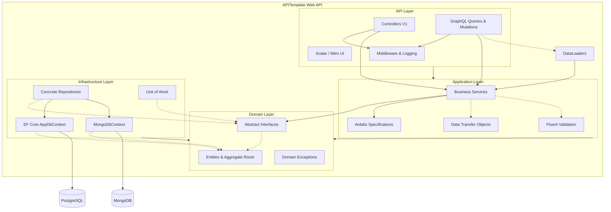
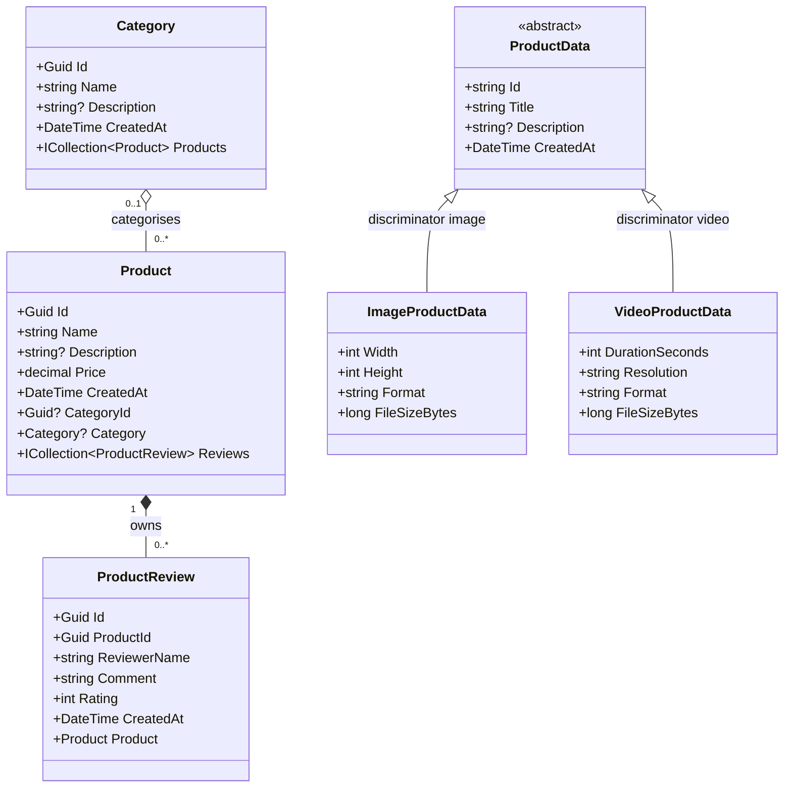

# APITemplate

A scalable, clean, and modern template designed to jumpstart **.NET 10** Web API and Data-Driven applications. By providing a curated set of industry-standard libraries and combining modern **REST** APIs side-by-side with a robust **GraphQL** backend, it bridges the gap between typical monolithic development speed and Clean Architecture principles within a single maintainable repository.

## 🚀 Key Features

*   **Architecture Pattern:** Clean mapping of concerns inside a monolithic solution (emulating Clean Architecture). `Domain` rules and interfaces are isolated from `Application` logic and `Infrastructure`.
*   **Dual API Modalities:**
    *   **REST API:** Clean HTTP endpoints using versioned controllers (`Asp.Versioning.Mvc`).
    *   **GraphQL API:** Complex query batching via `HotChocolate`, integrated Mutations and DataLoaders to eliminate the N+1 problem.
*   **Modern Interactive Documentation:** Native `.NET 10` OpenAPI integrations displayed smoothly in the browser using **Scalar** `/scalar`. Includes **Nitro UI** `/graphql/ui` for testing queries natively.
*   **Dual Database Architecture:**
    *   **PostgreSQL + EF Core 10:** Relational entities (Products, Categories, Reviews) with the Repository + Unit of Work pattern.
    *   **MongoDB:** Semi-structured media metadata (ProductData) with a polymorphic document model and BSON discriminators.
*   **Domain Filtering:** Seamless filtering, sorting, and paging powered by `Ardalis.Specification` to decouple query models from infrastructural EF abstractions.
*   **Enterprise-Grade Utilities:**
    *   **Validation:** Pipelined model validation using `FluentValidation.AspNetCore`.
    *   **Cross-Cutting Concerns:** Unified configuration via `Serilog` (Logging) and fully centralized Global Exception Management (`GlobalExceptionHandlerMiddleware`).
    *   **Authentication:** Pre-configured JWT secure endpoint access.
    *   **Observability:** Health Checks (`/health`) natively tracking both PostgreSQL and MongoDB state.
*   **Robust Testing Engine:** Provides isolated internal `Integration` tests using `UseInMemoryDatabase` combined with `WebApplicationFactory`, plus a comprehensive `Unit` test suite.

---

## 🏗 Architecture Diagram

The application leverages a single `.csproj` separated rationally via namespaces that conform to typical clean layer boundaries. The goal is friction-free deployments and dependency chains while ensuring long-term code organization.



---

## 📦 Domain Class Diagram

This class diagram models the aggregate roots and entities located natively within `Domain/Entities/`.



---

## 🛠 Technology Stack

*   **Runtime:** `.NET 10.0` Web SDK
*   **Relational Database:** PostgreSQL (`Npgsql`)
*   **Document Database:** MongoDB (`MongoDB.Driver`)
*   **ORM:** Entity Framework Core (`Microsoft.EntityFrameworkCore.Design`, `10.0`)
*   **API Toolkit:** ASP.NET Core, Asp.Versioning, `Scalar.AspNetCore`
*   **GraphQL Core:** HotChocolate `15.1`
*   **Utilities:** `Serilog.AspNetCore`, `FluentValidation`, `Ardalis.Specification`
*   **Test Suite:** xUnit, `Microsoft.AspNetCore.Mvc.Testing`

---

## 📂 Project Structure

This architecture deliberately leverages a single project (`APITemplate.csproj`) broken up securely by namespaces to mirror a traditional Clean Architecture without the multirepo/multiproject overhead:

```text
src/APITemplate/
├── Api/              # Presentation Tier (V1 REST Controllers, GraphQL Queries/Mutations, Global Middleware)
├── Application/      # Business Logic (Services, DTOs, FluentValidation, Ardalis Specs)
├── Domain/           # Core Logic (Entities, Value Objects, Domain Exceptions, Interfaces)
├── Infrastructure/   # Outer boundaries (AppDbContext, MongoDbContext, EF Core Repositories, MongoDB Repositories, Unit of Work)
└── Extensions/       # Startup IoC container bootstrappers
tests/APITemplate.Tests/
├── Integration/      # End-to-End API endpoint testing bridging a real/in-memory DB via WebApplicationFactory
└── Unit/             # Isolated internal service logic tests
```

---

## 🌐 REST API Reference

All versioned REST resource endpoints sit under the base path `api/v{version}`. JWT `Authorization: Bearer <token>` is required for these versioned API routes (except `POST /api/v1/Auth/login`), while utility endpoints such as `/health` and `/graphql/ui` are anonymous and `/scalar` is only mapped in Development.

### Auth

| Method | Path | Auth Required | Description |
|--------|------|:---:|-------------|
| `POST` | `/api/v1/Auth/login` | ❌ | Exchange credentials for a JWT token |

### Products

| Method | Path | Auth Required | Description |
|--------|------|:---:|-------------|
| `GET` | `/api/v1/Products` | ✅ | List products with filtering, sorting & paging |
| `GET` | `/api/v1/Products/{id}` | ✅ | Get a single product by GUID |
| `POST` | `/api/v1/Products` | ✅ | Create a new product |
| `PUT` | `/api/v1/Products/{id}` | ✅ | Update an existing product |
| `DELETE` | `/api/v1/Products/{id}` | ✅ | Delete a product |

### Categories

| Method | Path | Auth Required | Description |
|--------|------|:---:|-------------|
| `GET` | `/api/v1/Categories` | ✅ | List all categories |
| `GET` | `/api/v1/Categories/{id}` | ✅ | Get a category by GUID |
| `POST` | `/api/v1/Categories` | ✅ | Create a new category |
| `PUT` | `/api/v1/Categories/{id}` | ✅ | Update a category |
| `DELETE` | `/api/v1/Categories/{id}` | ✅ | Delete a category |
| `GET` | `/api/v1/Categories/{id}/stats` | ✅ | Aggregated stats via stored procedure |

### Product Reviews

| Method | Path | Auth Required | Description |
|--------|------|:---:|-------------|
| `GET` | `/api/v1/ProductReviews` | ✅ | List reviews with filtering & paging |
| `GET` | `/api/v1/ProductReviews/{id}` | ✅ | Get a review by GUID |
| `GET` | `/api/v1/ProductReviews/by-product/{productId}` | ✅ | All reviews for a given product |
| `POST` | `/api/v1/ProductReviews` | ✅ | Create a new review |
| `DELETE` | `/api/v1/ProductReviews/{id}` | ✅ | Delete a review |

### Product Data (MongoDB)

| Method | Path | Auth Required | Description |
|--------|------|:---:|-------------|
| `GET` | `/api/v1/product-data` | ✅ | List all or filter by `type` (image/video) |
| `GET` | `/api/v1/product-data/{id}` | ✅ | Get by MongoDB ObjectId |
| `POST` | `/api/v1/product-data/image` | ✅ | Create image media metadata |
| `POST` | `/api/v1/product-data/video` | ✅ | Create video media metadata |
| `DELETE` | `/api/v1/product-data/{id}` | ✅ | Delete by MongoDB ObjectId |

### Utility

| Method | Path | Auth Required | Description |
|--------|------|:---:|-------------|
| `GET` | `/health` | ❌ | JSON health status for PostgreSQL & MongoDB |
| `GET` | `/scalar` | ❌ | Interactive Scalar OpenAPI UI (**Development only** — disabled in Production) |
| `GET` | `/graphql/ui` | ❌ | HotChocolate Nitro GraphQL IDE |

---

## ⚙️ Configuration Reference

All configuration lives in `appsettings.json` (production defaults) and is overridden by `appsettings.Development.json` locally or by environment variables at runtime.

| Key | Example Value | Description |
|-----|--------------|-------------|
| `ConnectionStrings:DefaultConnection` | `Host=localhost;Port=5432;Database=apitemplate;Username=postgres;Password=postgres` | PostgreSQL connection string |
| `MongoDB:ConnectionString` | `mongodb://localhost:27017` | MongoDB connection string |
| `MongoDB:DatabaseName` | `apitemplate` | MongoDB database name |
| `Jwt:Secret` | *(recommended minimum 32 characters / 256 bits)* | HMAC-SHA256 signing key — **never commit a real secret** |
| `Jwt:Issuer` | `APITemplate` | JWT `iss` claim value |
| `Jwt:Audience` | `APITemplate.Clients` | JWT `aud` claim value |
| `Jwt:ExpirationMinutes` | `60` | Token lifetime in minutes |
| `Auth:Username` | `admin` | Hard-coded dev username (Development only) |
| `Auth:Password` | `admin` | Hard-coded dev password (Development only) |

> **Security note:** `Jwt:Secret` must be supplied via an environment variable or secret manager in production — never from a committed config file.

---

## 🔐 Authentication & Examples

Most REST and GraphQL endpoints might be protected by JWT Authentication (`[Authorize]`). A sample HTTP file (`src/APITemplate/APITemplate.http`) is included for simple direct execution from VS Code or Visual Studio.

**1. Acquiring a JWT Token via REST:**
Send your configured `Auth:Username` and `Auth:Password` (default: `admin`/`admin` per Development settings) to:
```http
POST /api/v1/Auth/login
Content-Type: application/json

{
    "username": "admin",
    "password": "admin"
}
```

### ⚡ GraphQL DataLoaders (N+1 Problem Solved)
By leveraging HotChocolate's built-in **DataLoaders** pipeline (`ProductReviewsByProductDataLoader`), fetching deeply nested parent-child relationships avoids querying the database `n` times. The framework collects IDs requested entirely within the GraphQL query, then queries the underlying EF Core PostgreSQL implementation precisely *once*.

**2. Example GraphQL Query (Using the token via `Authorization: Bearer <token>`):**
```graphql
query {
  products(take: 10, skip: 0) {
    items {
      id
      name
      price
      # Below triggers ONE bulk DataLoader fetch under the hood!
      reviews {
        reviewerName
        rating
      }
    }
    totalCount
  }
}
```

**3. Example GraphQL Mutation:**
```graphql
mutation {
  createProduct(input: {
    name: "New Masterpiece Board Game"
    price: 49.99
    description: "An epic adventure game"
  }) {
    id
    name
  }
}
```

---

## 🏆 Design Patterns & Best Practices

This template deliberately applies a number of industry-accepted patterns. Understanding *why* each pattern is used helps when extending the solution.

### 1 — Repository Pattern

Every data-store interaction is hidden behind a typed interface defined in `Domain/Interfaces/`. Application services depend only on `IProductRepository`, `ICategoryRepository`, etc., while controllers depend on those services — never directly on `AppDbContext` or `IMongoCollection<T>` .

**Benefits:**
- Database provider can be swapped without touching business logic.
- Repositories can be replaced with in-memory fakes or Moq mocks in tests.

### 2 — Unit of Work Pattern

`IUnitOfWork` (implemented by `UnitOfWork`) groups multiple repository writes into a single atomic `SaveChanges` call. It also exposes `ExecuteInTransactionAsync` for multi-step mutations that must succeed or roll back together.

```csharp
// Wraps two repository writes in a single database transaction
await _unitOfWork.ExecuteInTransactionAsync(async () =>
{
    await _productRepository.AddAsync(product);
    await _reviewRepository.AddAsync(review);
});
// Both rows committed or both rolled back
```

### 3 — Specification Pattern (Ardalis.Specification)

Query logic — filtering, ordering, pagination — lives in reusable `Specification<T, TResult>` classes rather than being scattered across services or repositories. A single `ProductSpecification` encapsulates all product-list query rules.

```csharp
// Application/Specifications/ProductSpecification.cs
public sealed class ProductSpecification : Specification<Product, ProductResponse>
{
    public ProductSpecification(ProductFilter filter)
    {
        ProductFilterCriteria.Apply(Query, filter);   // dynamic WHERE clauses
        Query.OrderByDescending(p => p.CreatedAt)
             .Select(p => new ProductResponse(...));  // projection to DTO
        Query.Skip((filter.PageNumber - 1) * filter.PageSize)
             .Take(filter.PageSize);
    }
}
```

**Benefits:**
- Keeps EF Core queries out of service classes.
- Specifications are independently testable.
- `ISpecificationEvaluator` (provided by `Ardalis.Specification.EntityFrameworkCore`) translates specs to SQL.

### 4 — FluentValidation with Auto-Validation & Cross-Field Rules

Models are validated automatically by `AddFluentValidationAutoValidation()` before the controller action body executes. Unlike Data Annotations, FluentValidation supports dynamic, cross-field business rules:

```csharp
// A shared base validator reused by both Create and Update validators
public abstract class ProductRequestValidatorBase<T> : AbstractValidator<T>
    where T : IProductRequest
{
    protected ProductRequestValidatorBase()
    {
        // Cross-field: Description is required only for expensive products
        RuleFor(x => x.Description)
            .NotEmpty().WithMessage("Description is required for products priced above 1000.")
            .When(x => x.Price > 1000);
    }
}
```

Validator classes are auto-discovered via `AddValidatorsFromAssemblyContaining<CreateProductRequestValidator>()` — no manual registration needed.

### 5 — Global Exception Middleware

`GlobalExceptionHandlerMiddleware` sits at the top of the pipeline and converts typed domain exceptions into consistent HTTP responses. This prevents accidental stack-trace leakage and ensures a uniform error shape (`{ "error": "..." }`) across the REST API.

| Exception type | HTTP Status | Logged at |
|----------------|-------------|-----------|
| `NotFoundException` | 404 | Warning |
| `ValidationException` | 400 | Warning |
| Anything else | 500 | Error |

> GraphQL requests are explicitly bypassed — HotChocolate handles its own error serialisation.

### 6 — API Versioning (URL Segment)

All controllers use URL-segment versioning (`/api/v1/…`) via `Asp.Versioning.Mvc`. The default version is `1.0`; new breaking changes should be introduced as `v2` controllers rather than modifying existing ones.

```csharp
[ApiVersion(1.0)]
[Route("api/v{version:apiVersion}/[controller]")]
public sealed class ProductsController : ControllerBase { ... }
```

### 7 — GraphQL Security & Performance Guards

HotChocolate is configured with several safeguards:

| Guard | Setting | Purpose |
|-------|---------|---------|
| `MaxPageSize` | 100 | Prevents unbounded result sets |
| `DefaultPageSize` | 20 | Sensible default for clients |
| `AddMaxExecutionDepthRule(5)` | depth ≤ 5 | Prevents deeply nested query attacks |
| `AddAuthorization()` | JWT required | Mirrors REST auth on GraphQL endpoints |

### 8 — Automatic Schema Migration at Startup

`UseDatabaseAsync()` runs EF Core migrations and MongoDB migrations automatically on startup. This means a fresh container deployment is fully self-initialising — no manual `dotnet ef database update` step required in production.

```csharp
// Extensions/ApplicationBuilderExtensions.cs
await dbContext.Database.MigrateAsync();   // PostgreSQL
await migrator.MigrateAsync();             // MongoDB (Kot.MongoDB.Migrations)
```

EF Core migrations are skipped when using the in-memory provider, and MongoDB migrations run only if a `MongoDbContext` is registered (they do not automatically skip when MongoDB is unreachable).

### 9 — Multi-Stage Docker Build

The `Dockerfile` follows Docker's multi-stage build best practice to minimise the final image size:

```
Stage 1 (build)  — mcr.microsoft.com/dotnet/sdk:10.0   ← includes compiler tools
Stage 2 (publish) — same SDK, runs dotnet publish -c Release
Stage 3 (final)  — mcr.microsoft.com/dotnet/aspnet:10.0 ← runtime only, ~60 MB
```

Only the compiled artefacts from Stage 2 are copied into the slim Stage 3 runtime image.

### 10 — Polyglot Persistence Decision Guide

| Data characteristic | Recommended store |
|---------------------|------------------|
| Relational data with foreign keys | PostgreSQL |
| Fixed, well-defined schema | PostgreSQL |
| ACID transactions across tables | PostgreSQL |
| Complex aggregations / reporting | PostgreSQL + stored procedure |
| Semi-structured or evolving schemas | MongoDB |
| Polymorphic document hierarchies | MongoDB |
| Media metadata, logs, audit events | MongoDB |

---

## 🗄 Stored Procedure Pattern (EF Core + PostgreSQL)

EF Core's `FromSql()` lets you call stored procedures while still getting full object materialisation and parameterised queries. The pattern below is used for the `GET /api/v1/categories/{id}/stats` endpoint.

### When to use a stored procedure

| Situation | Use LINQ | Use Stored Procedure |
|-----------|----------|----------------------|
| Simple CRUD filtering / paging | ✅ | |
| Complex multi-table aggregations | | ✅ |
| Reusable DB-side business logic | | ✅ |
| Query needs full EF change tracking | ✅ | |

### 4-step implementation

**Step 1 — Keyless entity** (no backing table, only a result-set shape)

```csharp
// Domain/Entities/ProductCategoryStats.cs
public sealed class ProductCategoryStats
{
    public Guid   CategoryId    { get; set; }
    public string CategoryName  { get; set; } = string.Empty;
    public long   ProductCount  { get; set; }
    public decimal AveragePrice { get; set; }
    public long   TotalReviews  { get; set; }
}
```

**Step 2 — EF configuration** (`HasNoKey` + `ExcludeFromMigrations`)

```csharp
// Infrastructure/Persistence/Configurations/ProductCategoryStatsConfiguration.cs
public sealed class ProductCategoryStatsConfiguration : IEntityTypeConfiguration<ProductCategoryStats>
{
    public void Configure(EntityTypeBuilder<ProductCategoryStats> builder)
    {
        builder.HasNoKey();
        // No backing table — skip this type during 'dotnet ef migrations add'
        builder.ToTable("ProductCategoryStats", t => t.ExcludeFromMigrations());
    }
}
```

**Step 3 — Migration** (create the PostgreSQL function in `Up`, drop it in `Down`)

```csharp
migrationBuilder.Sql("""
    CREATE OR REPLACE FUNCTION get_product_category_stats(p_category_id UUID)
    RETURNS TABLE(
        category_id UUID, category_name TEXT,
        product_count BIGINT, average_price NUMERIC, total_reviews BIGINT
    )
    LANGUAGE plpgsql AS $$
    BEGIN
        RETURN QUERY
        SELECT c."Id", c."Name"::TEXT,
               COUNT(DISTINCT p."Id"),
               COALESCE(AVG(p."Price"), 0),
               COUNT(pr."Id")
        FROM "Categories" c
        LEFT JOIN "Products"       p  ON p."CategoryId" = c."Id"
        LEFT JOIN "ProductReviews" pr ON pr."ProductId"  = p."Id"
        WHERE c."Id" = p_category_id
        GROUP BY c."Id", c."Name";
    END;
    $$;
    """);

// Down:
migrationBuilder.Sql("DROP FUNCTION IF EXISTS get_product_category_stats(UUID);");
```

**Step 4 — Repository call** via `FromSql` (auto-parameterised, injection-safe)

```csharp
// Infrastructure/Repositories/CategoryRepository.cs
public Task<ProductCategoryStats?> GetStatsByIdAsync(Guid categoryId, CancellationToken ct = default)
{
    // The interpolated {categoryId} is converted to a @p0 parameter by EF Core —
    // never use string concatenation here.
    return AppDb.ProductCategoryStats
        .FromSql($"SELECT * FROM get_product_category_stats({categoryId})")
        .FirstOrDefaultAsync(ct);
}
```

### Full request flow

```
GET /api/v1/categories/{id}/stats
        │
        ▼
CategoriesController.GetStats()
        │
        ▼
CategoryService.GetStatsAsync()
        │
        ▼
CategoryRepository.GetStatsByIdAsync()
        │  FromSql($"SELECT * FROM get_product_category_stats({id})")
        ▼
PostgreSQL  →  get_product_category_stats(p_category_id)
        │  returns: category_id, category_name, product_count, average_price, total_reviews
        ▼
EF Core maps columns → ProductCategoryStats (keyless entity)
        │
        ▼
ProductCategoryStatsResponse  (DTO returned to client)
```

---

## 🍃 MongoDB Polymorphic Pattern (ProductData)

The `ProductData` feature demonstrates a **polymorphic document model** in MongoDB, where a single collection stores two distinct subtypes (`ImageProductData`, `VideoProductData`) using the BSON discriminator pattern.

### When to use MongoDB vs PostgreSQL

| Situation | Use PostgreSQL | Use MongoDB |
|-----------|---------------|-------------|
| Relational data with foreign keys | ✅ | |
| Fixed, well-defined schema | ✅ | |
| ACID transactions across tables | ✅ | |
| Semi-structured or evolving schemas | | ✅ |
| Polymorphic document hierarchies | | ✅ |
| Media metadata, logs, events | | ✅ |

### Discriminator-based inheritance

```csharp
// Domain/Entities/ProductData.cs
[BsonDiscriminator(RootClass = true)]
[BsonKnownTypes(typeof(ImageProductData), typeof(VideoProductData))]
public abstract class ProductData
{
    [BsonId]
    [BsonRepresentation(BsonType.ObjectId)]
    public string Id { get; init; } = ObjectId.GenerateNewId().ToString();
    public string Title { get; init; } = string.Empty;
    public string? Description { get; init; }
    public DateTime CreatedAt { get; init; } = DateTime.UtcNow;
}

// Domain/Entities/ImageProductData.cs
[BsonDiscriminator("image")]
public sealed class ImageProductData : ProductData
{
    public int Width { get; init; }
    public int Height { get; init; }
    public string Format { get; init; } = string.Empty;   // jpg | png | gif | webp
    public long FileSizeBytes { get; init; }
}

// Domain/Entities/VideoProductData.cs
[BsonDiscriminator("video")]
public sealed class VideoProductData : ProductData
{
    public int DurationSeconds { get; init; }
    public string Resolution { get; init; } = string.Empty; // 720p | 1080p | 4K
    public string Format { get; init; } = string.Empty;     // mp4 | avi | mkv
    public long FileSizeBytes { get; init; }
}
```

MongoDB stores a `_t` discriminator field automatically, enabling polymorphic queries against the single `product_data` collection.

### REST endpoints

Base route: `api/v{version}/product-data` — all endpoints require JWT authorization.

| Method | Endpoint | Request | Response | Purpose |
|--------|----------|---------|----------|---------|
| `GET` | `/` | Query: `type` (optional) | `List<ProductDataResponse>` | List all or filter by type |
| `GET` | `/{id}` | MongoDB ObjectId string | `ProductDataResponse` / 404 | Get by ID |
| `POST` | `/image` | `CreateImageProductDataRequest` | `ProductDataResponse` 201 | Create image metadata |
| `POST` | `/video` | `CreateVideoProductDataRequest` | `ProductDataResponse` 201 | Create video metadata |
| `DELETE` | `/{id}` | MongoDB ObjectId string | 204 No Content | Delete by ID |

### Configuration

```json
// appsettings.json
{
  "MongoDB": {
    "ConnectionString": "mongodb://localhost:27017",
    "DatabaseName": "apitemplate"
  }
}
```

### Service registration

```csharp
// Extensions/ServiceCollectionExtensions.cs — AddMongoDB()
services.Configure<MongoDbSettings>(configuration.GetSection("MongoDB"));
services.AddSingleton<MongoDbContext>();
services.AddScoped<IProductDataRepository, ProductDataRepository>();
services.AddScoped<IProductDataService, ProductDataService>();
services.AddHealthChecks().AddMongoDb(...);
```

### Full request flow

```
POST /api/v1/product-data/image
        │
        ▼
ProductDataController.CreateImage()
        │  FluentValidation auto-validates CreateImageProductDataRequest
        ▼
ProductDataService.CreateImageAsync()
        │  Maps request → ImageProductData entity
        ▼
ProductDataRepository.CreateAsync()
        │  InsertOneAsync into product_data collection
        ▼
MongoDB  →  stores { _t: "image", Title, Width, Height, Format, ... }
        │
        ▼
ProductDataMappings.ToResponse()  (switch expression, polymorphic)
        │
        ▼
ProductDataResponse  (Type, Id, Title, Width, Height, Format, ...)
```

---

## 🚀 CI/CD & Deployments

While not natively shipped via default configuration files, this structure allows simple portability across cloud ecosystems:

**GitHub Actions / Azure Pipelines Structure:**
1. **Restore:** `dotnet restore src/APITemplate.sln`
2. **Build:** `dotnet build --no-restore src/APITemplate.sln`
3. **Test:** `dotnet test --no-build src/APITemplate.sln`
4. **Publish Container:** `docker build -t apitemplate-image:1.0 -f src/APITemplate/Dockerfile .`
5. **Push Registry:** `docker push <registry>/apitemplate-image:1.0`

Because the application encompasses the database (natively via DI) and HTTP context fully self-contained using containerization, it scales efficiently behind Kubernetes Ingress (Nginx) or any App Service / Container Apps equivalent, maintaining state natively using PostgreSQL and MongoDB.

---

## 🧪 Testing

The repository maintains an inclusive combination of **Unit Tests** and **Integration Tests** executing over a seamless Test-Host infrastructure.

### Test structure

| Folder | Technology | What it tests |
|--------|-----------|---------------|
| `tests/Unit/Services/` | xUnit + Moq | Service business logic in isolation |
| `tests/Unit/Repositories/` | xUnit + Moq | Repository filtering/query logic |
| `tests/Unit/Validators/` | xUnit + FluentValidation.TestHelper | Validator rules per DTO |
| `tests/Unit/Middleware/` | xUnit + Moq | Exception-to-HTTP mapping in `GlobalExceptionHandlerMiddleware` |
| `tests/Integration/` | xUnit + `WebApplicationFactory` | Full HTTP round-trips over in-memory database |

### Integration test isolation

`CustomWebApplicationFactory` replaces the Npgsql provider with `UseInMemoryDatabase`, removes `MongoDbContext`, and registers a mocked `IProductDataRepository` so DI validation passes. Each test class gets its own database name (a fresh `Guid`) so tests never share state.

```csharp
// Each factory instance gets its own isolated in-memory database
private readonly string _dbName = Guid.NewGuid().ToString();
services.AddDbContext<AppDbContext>(options =>
    options.UseInMemoryDatabase(_dbName));
```

### Running tests

```bash
# Run all tests
dotnet test

# Run only unit tests
dotnet test --filter "FullyQualifiedName~Unit"

# Run only integration tests
dotnet test --filter "FullyQualifiedName~Integration"
```

---

## 🏃 Getting Started

### Prerequisites
*   [.NET 10 SDK installed locally](https://dotnet.microsoft.com/)
*   [Docker Desktop](https://www.docker.com/) (Optional, convenient for running infrastructure).

### Quick Start (Using Docker Compose)

The template consists of a ready-to-use Docker environment to spool up both the PostgreSQL and MongoDB containers alongside the built API application immediately:

```bash
# Start up databases along with the API container
docker-compose up -d --build
```
> The API will bind natively to `http://localhost:8080`.

### Running Locally without Containerization

If you prefer spinning the `.NET Web API` application bare-metal, guarantee that reachable PostgreSQL and MongoDB instances are available. Apply your connection strings in `src/APITemplate/appsettings.Development.json`.

1. Run EF Migrations to build the default database tables:
    ```bash
    dotnet ef database update --project src/APITemplate
    ```
2. Spawn the Web Application:
    ```bash
    dotnet run --project src/APITemplate
    ```

### Available Endpoints & User Interfaces

Once fully spun up under a Development environment, check out:
- **Interactive REST API Documentation (Scalar):** `http://localhost:<port>/scalar`
- **Native GraphQL IDE (Nitro UI):** `http://localhost:<port>/graphql/ui`
- **Environment & Database Health Check:** `http://localhost:<port>/health`
