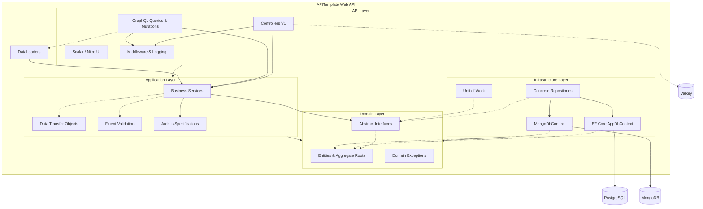
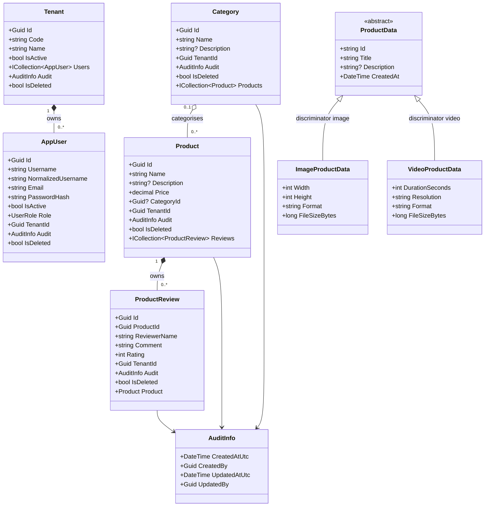

# APITemplate

A scalable, clean, and modern template designed to jumpstart **.NET 10** Web API and Data-Driven applications. By providing a curated set of industry-standard libraries and combining modern **REST** APIs side-by-side with a robust **GraphQL** backend, it bridges the gap between typical monolithic development speed and Clean Architecture principles within a single maintainable repository.

## 📚 How-To Guides

Step-by-step guides for the most common workflows in this project:

| Guide                                               | Description                                                                 |
| --------------------------------------------------- | --------------------------------------------------------------------------- |
| [GraphQL Endpoint](doc/graphql-endpoint.md)         | Add a type, query, mutation, and optional DataLoader                        |
| [REST Endpoint](doc/rest-endpoint.md)               | Full workflow: entity → DTO → validator → service → controller              |
| [EF Core Migration](doc/ef-migration.md)            | Create and apply PostgreSQL schema migrations                               |
| [MongoDB Migration](doc/mongodb-migration.md)       | Create index and data migrations with Kot.MongoDB.Migrations                |
| [Transactions](doc/transactions.md)                 | Wrap multiple operations in an atomic Unit of Work transaction              |
| [Authentication](doc/authentication.md)             | JWT login flow, protecting endpoints, and production guidance               |
| [Stored Procedures](doc/stored-procedures.md)       | Add a PostgreSQL function and call it safely from C#                        |
| [MongoDB Polymorphism](doc/mongodb-polymorphism.md) | Store multiple document subtypes in one collection                          |
| [Validation](doc/validation.md)                     | Add FluentValidation rules, cross-field rules, and shared validators        |
| [Specifications](doc/specifications.md)             | Write reusable EF Core query specifications with Ardalis                    |
| [Scalar & GraphQL UI](doc/scalar-and-graphql-ui.md) | Use the Scalar REST explorer and Nitro GraphQL playground                   |
| [Testing](doc/testing.md)                           | Write unit tests (services, validators, repositories) and integration tests |
| [Result Pattern](doc/result-pattern.md)             | Guidelines for introducing selective `Result<T>` flow in phase 2            |

---

## 🚀 Key Features

*   **Architecture Pattern:** Clean mapping of concerns inside a monolithic solution (emulating Clean Architecture). `Domain` rules and interfaces are isolated from `Application` logic and `Infrastructure`.
*   **Dual API Modalities:**
    *   **REST API:** Clean HTTP endpoints using versioned controllers (`Asp.Versioning.Mvc`).
    *   **GraphQL API:** Complex query batching via `HotChocolate`, integrated Mutations and DataLoaders to eliminate the N+1 problem.
*   **Modern Interactive Documentation:** Native `.NET 10` OpenAPI integrations displayed smoothly in the browser using **Scalar** `/scalar`. Includes **Nitro UI** `/graphql/ui` for testing queries natively.
*   **Dual Database Architecture:**
    *   **PostgreSQL + EF Core 10:** Relational entities (Products, Categories, Reviews, Tenants, Users) with the Repository + Unit of Work pattern.
    *   **MongoDB:** Semi-structured media metadata (ProductData) with a polymorphic document model and BSON discriminators.
*   **Multi-Tenancy:** Every relational entity implements `IAuditableTenantEntity`. `AppDbContext` enforces per-tenant read isolation via global query filters (`TenantId == currentTenant && !IsDeleted`). New rows are automatically stamped with the current tenant from the request JWT.
*   **Soft Delete with Cascade:** Delete operations are converted to soft-delete updates in `AppDbContext.SaveChangesAsync`. Cascade rules (e.g. `ProductSoftDeleteCascadeRule`) propagate soft-deletes to dependent entities without relying on database-level cascades.
*   **Audit Fields:** All entities carry `AuditInfo` (owned EF type) with `CreatedAtUtc`, `CreatedBy`, `UpdatedAtUtc`, `UpdatedBy`. Fields are stamped automatically in `SaveChangesAsync`.
*   **Optimistic Concurrency:** PostgreSQL native `xmin` system column configured as a concurrency token. `DbUpdateConcurrencyException` is mapped to HTTP 409 by `ApiExceptionHandler`.
*   **Rate Limiting:** Fixed-window per-client rate limiter (`100 req/min` default). Partition key priority: JWT username → remote IP → `"anonymous"`. Returns HTTP 429 on breach. Limits are configurable via `RateLimiting:Fixed`.
*   **Output Caching:** Tenant-isolated ASP.NET Core output cache backed by **Valkey** (Redis-compatible). Policies: `Products` (30 s), `Categories` (60 s), `Reviews` (30 s). Mutations evict affected tags. Falls back to in-memory when `Valkey:ConnectionString` is absent.
*   **Domain Filtering:** Seamless filtering, sorting, and paging powered by `Ardalis.Specification` to decouple query models from infrastructural EF abstractions.
*   **Enterprise-Grade Utilities:**
    *   **Validation:** Pipelined model validation using `FluentValidation.AspNetCore`.
    *   **Cross-Cutting Concerns:** Unified configuration via `Serilog` (structured logging with `MachineName` and `ThreadId` enrichers) and centralized exception handling via `IExceptionHandler` + RFC 7807 `ProblemDetails`.
    *   **Data Redaction:** Sensitive log properties (PII, secrets) are classified with `Microsoft.Extensions.Compliance` (`[PersonalData]`, `[SensitiveData]`) and HMAC-redacted before writing.
    *   **Authentication:** Pre-configured Keycloak JWT + BFF Cookie dual-auth with production hardening: secure-only cookies in production, server-side session store (`ValkeyTicketStore`) backed by Valkey, silent token refresh before expiry, and CSRF protection (`X-CSRF: 1` header required for cookie-authenticated mutations).
    *   **Observability:** Health Checks (`/health`) natively tracking PostgreSQL, MongoDB, and Valkey state.
*   **Robust Testing Engine:** Provides isolated internal `Integration` tests using `UseInMemoryDatabase` combined with `WebApplicationFactory`, plus a comprehensive `Unit` test suite.

---

## 🏗 Architecture Diagram

The application leverages a single `.csproj` separated rationally via namespaces that conform to typical clean layer boundaries. The goal is friction-free deployments and dependency chains while ensuring long-term code organization.



---

## 📦 Domain Class Diagram

This class diagram models the aggregate roots and entities located natively within `Domain/Entities/`.



---

## 🛠 Technology Stack

*   **Runtime:** `.NET 10.0` Web SDK
*   **Relational Database:** PostgreSQL 17 (`Npgsql`)
*   **Document Database:** MongoDB 8 (`MongoDB.Driver`)
*   **Cache / Rate Limit Backing Store:** Valkey 8 (Redis-compatible, `StackExchange.Redis`)
*   **ORM:** Entity Framework Core (`Microsoft.EntityFrameworkCore.Design`, `10.0`)
*   **API Toolkit:** ASP.NET Core, Asp.Versioning, `Scalar.AspNetCore`
*   **GraphQL Core:** HotChocolate `15.1`
*   **Auth:** Keycloak 26 (JWT Bearer + BFF Cookie via OIDC)
*   **Utilities:** `Serilog.AspNetCore`, `FluentValidation`, `Ardalis.Specification`, `Kot.MongoDB.Migrations`
*   **Test Suite:** xUnit, `Microsoft.AspNetCore.Mvc.Testing`, Moq, `MockQueryable.Moq`, `FluentValidation.TestHelper`

---

## 📂 Project Structure

This architecture deliberately leverages a single project (`APITemplate.csproj`) broken up securely by namespaces to mirror a traditional Clean Architecture without the multirepo/multiproject overhead:

```text
src/APITemplate/
├── Api/              # Presentation Tier (V1 REST Controllers, GraphQL Queries/Mutations, Cache policies, Global Middleware)
├── Application/      # Business Logic (Services, DTOs, FluentValidation, Ardalis Specs, Error catalog)
├── Domain/           # Core Logic (Entities, Value Objects, Domain Exceptions, Interfaces)
├── Infrastructure/   # Outer boundaries (AppDbContext, MongoDbContext, EF Core Repositories, MongoDB Repositories, Unit of Work, Logging redaction)
└── Extensions/       # Startup IoC container bootstrappers
tests/APITemplate.Tests/
├── Integration/      # End-to-End API endpoint testing bridging a real/in-memory DB via WebApplicationFactory
└── Unit/             # Isolated internal service logic tests
```

---

## 🌐 REST API Reference

All versioned REST resource endpoints sit under the base path `api/v{version}`. JWT `Authorization: Bearer <token>` is required for these versioned API routes. Authentication is handled externally by Keycloak (see [Authentication](#-authentication) section). Utility endpoints such as `/health` and `/graphql/ui` are anonymous, and `/scalar` is only mapped in Development.

> **Rate limiting:** all controller routes require the `fixed` rate-limit policy (100 requests per minute per authenticated user or remote IP).

### Products

| Method   | Path                    | Auth Required | Description                                    |
| -------- | ----------------------- | :-----------: | ---------------------------------------------- |
| `GET`    | `/api/v1/Products`      |       ✅       | List products with filtering, sorting & paging |
| `GET`    | `/api/v1/Products/{id}` |       ✅       | Get a single product by GUID                   |
| `POST`   | `/api/v1/Products`      |       ✅       | Create a new product                           |
| `PUT`    | `/api/v1/Products/{id}` |       ✅       | Update an existing product                     |
| `DELETE` | `/api/v1/Products/{id}` |       ✅       | Soft-delete a product (cascades to reviews)    |

### Categories

| Method   | Path                            | Auth Required | Description                           |
| -------- | ------------------------------- | :-----------: | ------------------------------------- |
| `GET`    | `/api/v1/Categories`            |       ✅       | List all categories                   |
| `GET`    | `/api/v1/Categories/{id}`       |       ✅       | Get a category by GUID                |
| `POST`   | `/api/v1/Categories`            |       ✅       | Create a new category                 |
| `PUT`    | `/api/v1/Categories/{id}`       |       ✅       | Update a category                     |
| `DELETE` | `/api/v1/Categories/{id}`       |       ✅       | Soft-delete a category                |
| `GET`    | `/api/v1/Categories/{id}/stats` |       ✅       | Aggregated stats via stored procedure |

### Product Reviews

| Method   | Path                                            | Auth Required | Description                          |
| -------- | ----------------------------------------------- | :-----------: | ------------------------------------ |
| `GET`    | `/api/v1/ProductReviews`                        |       ✅       | List reviews with filtering & paging |
| `GET`    | `/api/v1/ProductReviews/{id}`                   |       ✅       | Get a review by GUID                 |
| `GET`    | `/api/v1/ProductReviews/by-product/{productId}` |       ✅       | All reviews for a given product      |
| `POST`   | `/api/v1/ProductReviews`                        |       ✅       | Create a new review                  |
| `DELETE` | `/api/v1/ProductReviews/{id}`                   |       ✅       | Soft-delete a review                 |

### Product Data (MongoDB)

| Method   | Path                         | Auth Required | Description                                |
| -------- | ---------------------------- | :-----------: | ------------------------------------------ |
| `GET`    | `/api/v1/product-data`       |       ✅       | List all or filter by `type` (image/video) |
| `GET`    | `/api/v1/product-data/{id}`  |       ✅       | Get by MongoDB ObjectId                    |
| `POST`   | `/api/v1/product-data/image` |       ✅       | Create image media metadata                |
| `POST`   | `/api/v1/product-data/video` |       ✅       | Create video media metadata                |
| `DELETE` | `/api/v1/product-data/{id}`  |       ✅       | Delete by MongoDB ObjectId                 |

### Utility

| Method | Path          | Auth Required | Description                                                                   |
| ------ | ------------- | :-----------: | ----------------------------------------------------------------------------- |
| `GET`  | `/health`     |       ❌       | JSON health status for PostgreSQL, MongoDB & Valkey                           |
| `GET`  | `/scalar`     |       ❌       | Interactive Scalar OpenAPI UI (**Development only** — disabled in Production) |
| `GET`  | `/graphql/ui` |       ❌       | HotChocolate Nitro GraphQL IDE                                                |

---

## ⚙️ Configuration Reference

All configuration lives in `appsettings.json` (production defaults) and is overridden by `appsettings.Development.json` locally or by environment variables at runtime.

| Key                                   | Example Value                                                                       | Description                                                                                            |
| ------------------------------------- | ----------------------------------------------------------------------------------- | ------------------------------------------------------------------------------------------------------ |
| `ConnectionStrings:DefaultConnection` | `Host=localhost;Port=5432;Database=apitemplate;Username=postgres;Password=postgres` | PostgreSQL connection string                                                                           |
| `MongoDB:ConnectionString`            | `mongodb://localhost:27017`                                                         | MongoDB connection string                                                                              |
| `MongoDB:DatabaseName`                | `apitemplate`                                                                       | MongoDB database name                                                                                  |
| `Valkey:ConnectionString`             | `localhost:6379`                                                                    | Valkey (Redis-compatible) connection string for distributed output cache. Omit to use in-memory cache. |
| `Keycloak:auth-server-url`            | `http://localhost:8180/`                                                            | Keycloak base URL                                                                                      |
| `Keycloak:realm`                      | `api-template`                                                                      | Keycloak realm name                                                                                    |
| `Keycloak:resource`                   | `api-template`                                                                      | Keycloak client ID                                                                                     |
| `Keycloak:credentials:secret`         | `dev-client-secret`                                                                 | Keycloak client secret — **never commit a real secret**                                                |
| `Keycloak:SkipReadinessCheck`         | `false`                                                                             | Set to `true` to skip the startup Keycloak reachability check                                          |
| `Bff:CookieName`                      | `.APITemplate.Auth`                                                                 | BFF session cookie name                                                                                |
| `Bff:SessionTimeoutMinutes`           | `60`                                                                                | BFF cookie session lifetime                                                                            |
| `Bff:PostLogoutRedirectUri`           | `/`                                                                                 | Redirect URI after BFF logout                                                                          |
| `Bff:Scopes`                          | `["openid","profile","email","offline_access"]`                                     | OIDC scopes requested during BFF login                                                                 |
| `Bff:TokenRefreshThresholdMinutes`    | `2`                                                                                 | Refresh the access token this many minutes before expiry                                               |
| `RateLimiting:Fixed:PermitLimit`      | `100`                                                                               | Maximum requests allowed per window                                                                    |
| `RateLimiting:Fixed:WindowMinutes`    | `1`                                                                                 | Fixed window duration in minutes                                                                       |
| `Caching:ProductsExpirationSeconds`   | `30`                                                                                | Output cache TTL for the Products policy                                                               |
| `Caching:CategoriesExpirationSeconds` | `60`                                                                                | Output cache TTL for the Categories policy                                                             |
| `Caching:ReviewsExpirationSeconds`    | `30`                                                                                | Output cache TTL for the Reviews policy                                                                |
| `Persistence:PostgresRetry:Enabled`  | `true`                                                                              | Enables transient PostgreSQL retry behavior for EF Core/Npgsql                                         |
| `Persistence:PostgresRetry:MaxRetryCount` | `3`                                                                           | Maximum retry attempts for transient PostgreSQL failures                                               |
| `Persistence:PostgresRetry:MaxRetryDelaySeconds` | `5`                                                                     | Maximum delay between transient PostgreSQL retry attempts in seconds                                   |
| `SystemIdentity:DefaultActorId`       | `00000000-0000-0000-0000-000000000000`                                              | Default actor GUID used when no request actor context is available                                     |
| `Bootstrap:Tenant:Code`               | `default`                                                                           | Bootstrap tenant code seeded at startup                                                                |
| `Bootstrap:Tenant:Name`               | `Default Tenant`                                                                    | Bootstrap tenant display name                                                                          |
| `Cors:AllowedOrigins`                 | `["http://localhost:3000","http://localhost:5173"]`                                 | Allowed origins for the default CORS policy                                                            |

> **Security note:** `Keycloak:credentials:secret` must be supplied via an environment variable or secret manager in production — never from a committed config file.

---

## 🔐 Authentication

Authentication is handled by **Keycloak** using a hybrid approach that supports both **JWT Bearer tokens** (for API clients and Scalar) and **BFF Cookie sessions** (for SPA frontends).

| Flow           | Use Case                                   | How it works                                                                                              |
| -------------- | ------------------------------------------ | --------------------------------------------------------------------------------------------------------- |
| **JWT Bearer** | Scalar UI, API clients, service-to-service | `Authorization: Bearer <token>` header                                                                    |
| **BFF Cookie** | SPA frontend                               | `/api/v1/bff/login` → Keycloak login → session cookie → direct API calls with cookie + `X-CSRF: 1` header |

#### BFF Production Hardening

| Feature                        | Detail                                                                                                                                                                                                                                      |
| ------------------------------ | ------------------------------------------------------------------------------------------------------------------------------------------------------------------------------------------------------------------------------------------- |
| **Secure cookie**              | `CookieSecurePolicy.Always` in production; `SameAsRequest` in development                                                                                                                                                                   |
| **Server-side session store**  | `ValkeyTicketStore` serialises the auth ticket to Valkey — the cookie contains only a GUID key, keeping cookie size small and preventing token leakage                                                                                      |
| **Shared DataProtection keys** | Keys persisted to Valkey under `DataProtection:Keys` so multiple instances can decrypt each other's cookies                                                                                                                                 |
| **Silent token refresh**       | `CookieSessionRefresher.OnValidatePrincipal` exchanges the refresh token with Keycloak when the access token is within `Bff:TokenRefreshThresholdMinutes` (default 2 min) of expiry                                                         |
| **CSRF protection**            | `CsrfValidationMiddleware` requires the `X-CSRF: 1` header on all non-GET/HEAD/OPTIONS requests authenticated via the cookie scheme. JWT Bearer requests are exempt. Call `GET /api/v1/bff/csrf` to retrieve the expected header name/value |

### BFF Endpoints

| Method | Path                 | Auth  | Description                                                      |
| ------ | -------------------- | :---: | ---------------------------------------------------------------- |
| `GET`  | `/api/v1/bff/login`  |   ❌   | Redirects to Keycloak login page                                 |
| `GET`  | `/api/v1/bff/logout` |   🍪   | Signs out from both cookie and Keycloak                          |
| `GET`  | `/api/v1/bff/user`   |   🍪   | Returns current user info (id, username, email, tenantId, roles) |
| `GET`  | `/api/v1/bff/csrf`   |   ❌   | Returns the required CSRF header name and value (`X-CSRF: 1`)    |

### Manual Testing Guide

#### Option A: Scalar UI with OAuth2 (recommended)

1. Start the infrastructure:
   ```bash
   docker compose up -d
   ```
2. Run the API (via VS Code debugger or CLI):
   ```bash
   dotnet run --project src/APITemplate
   ```
3. Open **Scalar UI**: `http://localhost:5174/scalar`
4. Click the **Authorize** button in Scalar
5. You will be redirected to Keycloak — log in with `admin` / `Admin123`
6. After successful login, Scalar will automatically attach the JWT token to all requests
7. Try any endpoint (e.g. `GET /api/v1/Products`)

#### Option B: BFF Cookie flow (browser)

1. Open `http://localhost:5174/api/v1/bff/login` in a browser
2. Log in with `admin` / `Admin123` on the Keycloak page
3. After redirect, call API endpoints directly in the browser — the session cookie is sent automatically with every request
4. Check your session: `http://localhost:5174/api/v1/bff/user`

#### Option C: Direct token via cURL

```bash
# Get a token from Keycloak (requires Direct Access Grants enabled on the client)
TOKEN=$(curl -s -X POST http://localhost:8180/realms/api-template/protocol/openid-connect/token \
  -d "grant_type=password&client_id=api-template&client_secret=dev-client-secret&username=admin&password=Admin123" \
  | jq -r '.access_token')

# Use the token
curl -H "Authorization: Bearer $TOKEN" http://localhost:5174/api/v1/products
```

> **Note:** Direct Access Grants (password grant) is disabled by default. Enable it in Keycloak Admin (`http://localhost:8180/admin` → api-template client → Settings) if needed.

### ⚡ GraphQL DataLoaders (N+1 Problem Solved)
By leveraging HotChocolate's built-in **DataLoaders** pipeline (`ProductReviewsByProductDataLoader`), fetching deeply nested parent-child relationships avoids querying the database `n` times. The framework collects IDs requested entirely within the GraphQL query, then queries the underlying EF Core PostgreSQL implementation precisely *once*.

**Example GraphQL Query:**
```graphql
query {
  products(input: { pageNumber: 1, pageSize: 10 }) {
    items {
      id
      name
      price
      # Below triggers ONE bulk DataLoader fetch under the hood!
      reviews {
        reviewerName
        rating
      }
    }
    pageNumber
    pageSize
    totalCount
  }
}
```

**Example GraphQL Mutation:**
```graphql
mutation {
  createProduct(input: {
    name: "New Masterpiece Board Game"
    price: 49.99
    description: "An epic adventure game"
  }) {
    id
    name
  }
}
```

---

## 🏆 Design Patterns & Best Practices

This template deliberately applies a number of industry-accepted patterns. Understanding *why* each pattern is used helps when extending the solution.

### 1 — Repository Pattern

Every data-store interaction is hidden behind a typed interface defined in `Domain/Interfaces/`. Application services depend only on `IProductRepository`, `ICategoryRepository`, etc., while controllers depend on those services — never directly on `AppDbContext` or `IMongoCollection<T>`.

**Benefits:**
- Database provider can be swapped without touching business logic.
- Repositories can be replaced with in-memory fakes or Moq mocks in tests.

### 2 — Unit of Work Pattern

`IUnitOfWork` (implemented by `UnitOfWork`) is the only commit boundary for relational persistence. Repositories stage changes in EF Core's change tracker, but they never call `SaveChangesAsync` directly. In this template, relational write services use `ExecuteTransactionalWriteAsync(...)`, which wraps `ExecuteInTransactionAsync(...)` behind one uniform application-level entry point.

**Rules:**
- Query services own API/read-model reads that return DTOs.
- Paginated, filtered, cross-aggregate, and batching reads belong in query services, usually backed by specifications or projections.
- Command-side validation lookups stay in the write service and use repositories directly.
- Write services load entities they intend to mutate through repositories, not query services.
- `ExecuteTransactionalWriteAsync(...)` is the service-layer write wrapper used by the template.
- Some single-write flows do not strictly require an explicit transaction; the wrapper is still used to keep one consistent write shape across relational features.
- `Persistence:PostgresRetry` configures transient PostgreSQL retries at the provider level.
- Explicit transactional writes run inside EF Core's execution strategy so the full transaction block can be replayed on transient provider failures.

```csharp
// Wraps two repository writes in a single database transaction
await _unitOfWork.ExecuteInTransactionAsync(async () =>
{
    await _productRepository.AddAsync(product);
    await _reviewRepository.AddAsync(review);
});
// Both rows committed or both rolled back
```

Service code uses the helper below to keep a single write pattern:

```csharp
await _unitOfWork.ExecuteTransactionalWriteAsync(async () =>
{
    await _repository.AddAsync(product, ct);
    return product;
}, ct);
```

### 3 — Specification Pattern (Ardalis.Specification)

Query logic — filtering, ordering, pagination — lives in reusable `Specification<T, TResult>` classes rather than being scattered across services or repositories. A single `ProductSpecification` encapsulates all product-list query rules.

```csharp
// Application/Specifications/ProductSpecification.cs
public sealed class ProductSpecification : Specification<Product, ProductResponse>
{
    public ProductSpecification(ProductFilter filter)
    {
        ProductFilterCriteria.Apply(Query, filter);   // dynamic WHERE clauses
        Query.OrderByDescending(p => p.CreatedAt)
             .Select(p => new ProductResponse(...));  // projection to DTO
        Query.Skip((filter.PageNumber - 1) * filter.PageSize)
             .Take(filter.PageSize);
    }
}
```

**Benefits:**
- Keeps EF Core queries out of service classes.
- Specifications are independently testable.
- `ISpecificationEvaluator` (provided by `Ardalis.Specification.EntityFrameworkCore`) translates specs to SQL.

### 4 — FluentValidation with Auto-Validation & Cross-Field Rules

Models are validated automatically by `FluentValidationActionFilter` before the controller action body executes. Unlike Data Annotations, FluentValidation supports dynamic, cross-field business rules:

```csharp
// A shared base validator reused by both Create and Update validators
public abstract class ProductRequestValidatorBase<T> : AbstractValidator<T>
    where T : IProductRequest
{
    protected ProductRequestValidatorBase()
    {
        // Cross-field: Description is required only for expensive products
        RuleFor(x => x.Description)
            .NotEmpty().WithMessage("Description is required for products priced above 1000.")
            .When(x => x.Price > 1000);
    }
}
```

Validator classes are auto-discovered via `AddValidatorsFromAssemblyContaining<CreateProductRequestValidator>()` — no manual registration needed.

### 5 — Global Exception Handling (`IExceptionHandler` + ProblemDetails)

`ApiExceptionHandler` sits in the ASP.NET exception pipeline (`UseExceptionHandler`) and converts typed `AppException` instances into RFC 7807 `ProblemDetails` responses. HTTP status/title are mapped by exception type (`ValidationException`, `NotFoundException`, `ConflictException`, `ForbiddenException`), while `ErrorCode` is resolved from `AppException.ErrorCode` or metadata fallback. `DbUpdateConcurrencyException` is mapped directly to HTTP 409.

| Exception type                 | HTTP Status | Logged at |
| ------------------------------ | ----------- | --------- |
| `NotFoundException`            | 404         | Warning   |
| `ValidationException`          | 400         | Warning   |
| `ForbiddenException`           | 403         | Warning   |
| `ConflictException`            | 409         | Warning   |
| `DbUpdateConcurrencyException` | 409         | Warning   |
| Anything else                  | 500         | Error     |

Response extensions are standardized through `AddProblemDetails(...)` customization:
- `errorCode` (primary code, e.g. `PRD-0404`)
- `traceId` (request correlation)
- `metadata` (optional structured details for business errors)

Example payload:

```json
{
  "type": "https://api-template.local/errors/PRD-0404",
  "title": "Not Found",
  "status": 404,
  "detail": "Product with id '...' not found.",
  "instance": "/api/v1/products/...",
  "traceId": "0HN...",
  "errorCode": "PRD-0404"
}
```

Error code catalog:

| Code                   | HTTP | Meaning                                  |
| ---------------------- | ---- | ---------------------------------------- |
| `GEN-0001`             | 500  | Unknown/unhandled server error           |
| `GEN-0400`             | 400  | Generic validation failure               |
| `GEN-0404`             | 404  | Generic resource not found               |
| `GEN-0409`             | 409  | Generic conflict                         |
| `GEN-0409-CONCURRENCY` | 409  | Optimistic concurrency conflict          |
| `AUTH-0403`            | 403  | Forbidden                                |
| `PRD-0404`             | 404  | Product not found                        |
| `CAT-0404`             | 404  | Category not found                       |
| `REV-0404`             | 404  | Review not found                         |
| `REV-2101`             | 404  | Product not found when creating a review |

> GraphQL requests are explicitly bypassed — HotChocolate handles its own error serialisation.

### 6 — API Versioning (URL Segment)

All controllers use URL-segment versioning (`/api/v1/…`) via `Asp.Versioning.Mvc`. The default version is `1.0`; new breaking changes should be introduced as `v2` controllers rather than modifying existing ones.

```csharp
[ApiVersion(1.0)]
[Route("api/v{version:apiVersion}/[controller]")]
public sealed class ProductsController : ControllerBase { ... }
```

### 7 — Multi-Tenancy & Audit

All relational entities implement `IAuditableTenantEntity` (combines `ITenantEntity`, `IAuditableEntity`, `ISoftDeletable`). `AppDbContext` automatically:

- **Applies global query filters** on every read: `!entity.IsDeleted && entity.TenantId == currentTenant`.
- **Stamps audit fields** on Add (`CreatedAtUtc`, `CreatedBy`) and Modify (`UpdatedAtUtc`, `UpdatedBy`).
- **Auto-assigns TenantId** on insert from the JWT claim resolved by `HttpTenantProvider`.
- **Converts hard deletes to soft deletes**, running registered `ISoftDeleteCascadeRule` implementations to propagate to dependents (e.g. `ProductSoftDeleteCascadeRule` cascades to `ProductReviews`).

### 8 — Rate Limiting

All REST controller routes require the `fixed` rate-limit policy. Partitioning isolates limits per authenticated user or per IP for anonymous callers:

```
Partition key priority:
  1. JWT username  (authenticated users each get their own bucket)
  2. Remote IP     (anonymous callers share a per-IP bucket)
  3. "anonymous"   (fallback when neither is available)
```

Limits are configured in `appsettings.json` under `RateLimiting:Fixed` and resolved via `IOptions<RateLimitingOptions>` so integration tests can override them without rebuilding the host.

### 9 — Output Caching (Tenant-Isolated, Valkey-backed)

GET endpoints on Products, Categories, and Reviews use `[OutputCache(PolicyName = ...)]` with the `TenantAwareOutputCachePolicy`. This policy:

1. **Enables caching for authenticated requests** (ASP.NET Core's default skips Authorization-header requests).
2. **Varies the cache key by tenant ID** so one tenant never receives another tenant's cached response.

When `Valkey:ConnectionString` is configured, all cache entries are stored in **Valkey** so every application instance shares a single distributed cache. Without it, each instance maintains its own in-memory cache.

Mutations (Create / Update / Delete) evict the relevant tag via `IOutputCacheStore.EvictByTagAsync()` so stale data is immediately invalidated.

### 10 — GraphQL Security & Performance Guards

HotChocolate is configured with several safeguards:

| Guard                         | Setting                | Purpose                                           |
| ----------------------------- | ---------------------- | ------------------------------------------------- |
| `MaxPageSize`                 | 100                    | Prevents unbounded result sets                    |
| `DefaultPageSize`             | 20                     | Sensible default for clients                      |
| `AddMaxExecutionDepthRule(5)` | depth ≤ 5              | Prevents deeply nested query attacks              |
| `AddAuthorization()`          | policy support enabled | Enables `[Authorize]` on GraphQL fields/mutations |

GraphQL query and mutation fields are protected with `[Authorize]`.

### 11 — Automatic Schema Migration at Startup

`UseDatabaseAsync()` runs EF Core migrations, auth bootstrap seeding, and MongoDB migrations automatically on startup. This means a fresh container deployment is fully self-initialising — no manual `dotnet ef database update` step required in production.

```csharp
// Extensions/ApplicationBuilderExtensions.cs
await dbContext.Database.MigrateAsync();   // PostgreSQL (skipped for InMemory provider)
await seeder.SeedAsync();                  // bootstrap tenant + admin user
await migrator.MigrateAsync();             // MongoDB (Kot.MongoDB.Migrations)
```

### 12 — Multi-Stage Docker Build

The `Dockerfile` follows Docker's multi-stage build best practice to minimise the final image size:

```
Stage 1 (build)   — mcr.microsoft.com/dotnet/sdk:10.0   ← includes compiler tools
Stage 2 (publish) — same SDK, runs dotnet publish -c Release
Stage 3 (final)   — mcr.microsoft.com/dotnet/aspnet:10.0 ← runtime only, ~60 MB
```

Only the compiled artefacts from Stage 2 are copied into the slim Stage 3 runtime image.

### 13 — Polyglot Persistence Decision Guide

| Data characteristic                 | Recommended store             |
| ----------------------------------- | ----------------------------- |
| Relational data with foreign keys   | PostgreSQL                    |
| Fixed, well-defined schema          | PostgreSQL                    |
| ACID transactions across tables     | PostgreSQL                    |
| Complex aggregations / reporting    | PostgreSQL + stored procedure |
| Semi-structured or evolving schemas | MongoDB                       |
| Polymorphic document hierarchies    | MongoDB                       |
| Media metadata, logs, audit events  | MongoDB                       |

---

## 🗄 Stored Procedure Pattern (EF Core + PostgreSQL)

EF Core's `FromSql()` lets you call stored procedures while still getting full object materialisation and parameterised queries. The pattern below is used for the `GET /api/v1/categories/{id}/stats` endpoint.

### When to use a stored procedure

| Situation                           | Use LINQ | Use Stored Procedure |
| ----------------------------------- | -------- | -------------------- |
| Simple CRUD filtering / paging      | ✅        |                      |
| Complex multi-table aggregations    |          | ✅                    |
| Reusable DB-side business logic     |          | ✅                    |
| Query needs full EF change tracking | ✅        |                      |

### 4-step implementation

**Step 1 — Keyless entity** (no backing table, only a result-set shape)

```csharp
// Domain/Entities/ProductCategoryStats.cs
public sealed class ProductCategoryStats
{
    public Guid   CategoryId    { get; set; }
    public string CategoryName  { get; set; } = string.Empty;
    public long   ProductCount  { get; set; }
    public decimal AveragePrice { get; set; }
    public long   TotalReviews  { get; set; }
}
```

**Step 2 — EF configuration** (`HasNoKey` + `ExcludeFromMigrations`)

```csharp
// Infrastructure/Persistence/Configurations/ProductCategoryStatsConfiguration.cs
public sealed class ProductCategoryStatsConfiguration : IEntityTypeConfiguration<ProductCategoryStats>
{
    public void Configure(EntityTypeBuilder<ProductCategoryStats> builder)
    {
        builder.HasNoKey();
        // No backing table — skip this type during 'dotnet ef migrations add'
        builder.ToTable("ProductCategoryStats", t => t.ExcludeFromMigrations());
    }
}
```

**Step 3 — Migration** (create the PostgreSQL function in `Up`, drop it in `Down`)

```csharp
migrationBuilder.Sql("""
    CREATE OR REPLACE FUNCTION get_product_category_stats(p_category_id UUID)
    RETURNS TABLE(
        category_id UUID, category_name TEXT,
        product_count BIGINT, average_price NUMERIC, total_reviews BIGINT
    )
    LANGUAGE plpgsql AS $$
    BEGIN
        RETURN QUERY
        SELECT c."Id", c."Name"::TEXT,
               COUNT(DISTINCT p."Id"),
               COALESCE(AVG(p."Price"), 0),
               COUNT(pr."Id")
        FROM "Categories" c
        LEFT JOIN "Products"       p  ON p."CategoryId" = c."Id"
        LEFT JOIN "ProductReviews" pr ON pr."ProductId"  = p."Id"
        WHERE c."Id" = p_category_id
        GROUP BY c."Id", c."Name";
    END;
    $$;
    """);

// Down:
migrationBuilder.Sql("DROP FUNCTION IF EXISTS get_product_category_stats(UUID);");
```

**Step 4 — Repository call** via `FromSql` (auto-parameterised, injection-safe)

```csharp
// Infrastructure/Repositories/CategoryRepository.cs
public Task<ProductCategoryStats?> GetStatsByIdAsync(Guid categoryId, CancellationToken ct = default)
{
    // The interpolated {categoryId} is converted to a @p0 parameter by EF Core —
    // never use string concatenation here.
    return AppDb.ProductCategoryStats
        .FromSql($"SELECT * FROM get_product_category_stats({categoryId})")
        .FirstOrDefaultAsync(ct);
}
```

### Full request flow

```
GET /api/v1/categories/{id}/stats
        │
        ▼
CategoriesController.GetStats()
        │
        ▼
CategoryService.GetStatsAsync()
        │
        ▼
CategoryRepository.GetStatsByIdAsync()
        │  FromSql($"SELECT * FROM get_product_category_stats({id})")
        ▼
PostgreSQL  →  get_product_category_stats(p_category_id)
        │  returns: category_id, category_name, product_count, average_price, total_reviews
        ▼
EF Core maps columns → ProductCategoryStats (keyless entity)
        │
        ▼
ProductCategoryStatsResponse  (DTO returned to client)
```

---

## 🍃 MongoDB Polymorphic Pattern (ProductData)

The `ProductData` feature demonstrates a **polymorphic document model** in MongoDB, where a single collection stores two distinct subtypes (`ImageProductData`, `VideoProductData`) using the BSON discriminator pattern.

### When to use MongoDB vs PostgreSQL

| Situation                           | Use PostgreSQL | Use MongoDB |
| ----------------------------------- | -------------- | ----------- |
| Relational data with foreign keys   | ✅              |             |
| Fixed, well-defined schema          | ✅              |             |
| ACID transactions across tables     | ✅              |             |
| Semi-structured or evolving schemas |                | ✅           |
| Polymorphic document hierarchies    |                | ✅           |
| Media metadata, logs, events        |                | ✅           |

### Discriminator-based inheritance

```csharp
// Domain/Entities/ProductData.cs
[BsonDiscriminator(RootClass = true)]
[BsonKnownTypes(typeof(ImageProductData), typeof(VideoProductData))]
public abstract class ProductData
{
    [BsonId]
    [BsonRepresentation(BsonType.ObjectId)]
    public string Id { get; init; } = ObjectId.GenerateNewId().ToString();
    public string Title { get; init; } = string.Empty;
    public string? Description { get; init; }
    public DateTime CreatedAt { get; init; } = DateTime.UtcNow;
}

// Domain/Entities/ImageProductData.cs
[BsonDiscriminator("image")]
public sealed class ImageProductData : ProductData
{
    public int Width { get; init; }
    public int Height { get; init; }
    public string Format { get; init; } = string.Empty;   // jpg | png | gif | webp
    public long FileSizeBytes { get; init; }
}

// Domain/Entities/VideoProductData.cs
[BsonDiscriminator("video")]
public sealed class VideoProductData : ProductData
{
    public int DurationSeconds { get; init; }
    public string Resolution { get; init; } = string.Empty; // 720p | 1080p | 4K
    public string Format { get; init; } = string.Empty;     // mp4 | avi | mkv
    public long FileSizeBytes { get; init; }
}
```

MongoDB stores a `_t` discriminator field automatically, enabling polymorphic queries against the single `product_data` collection.

### REST endpoints

Base route: `api/v{version}/product-data` — all endpoints require JWT authorization.

| Method   | Endpoint | Request                         | Response                    | Purpose                    |
| -------- | -------- | ------------------------------- | --------------------------- | -------------------------- |
| `GET`    | `/`      | Query: `type` (optional)        | `List<ProductDataResponse>` | List all or filter by type |
| `GET`    | `/{id}`  | MongoDB ObjectId string         | `ProductDataResponse` / 404 | Get by ID                  |
| `POST`   | `/image` | `CreateImageProductDataRequest` | `ProductDataResponse` 201   | Create image metadata      |
| `POST`   | `/video` | `CreateVideoProductDataRequest` | `ProductDataResponse` 201   | Create video metadata      |
| `DELETE` | `/{id}`  | MongoDB ObjectId string         | 204 No Content              | Delete by ID               |

### Full request flow

```
POST /api/v1/product-data/image
        │
        ▼
ProductDataController.CreateImage()
        │  FluentValidation auto-validates CreateImageProductDataRequest
        ▼
ProductDataService.CreateImageAsync()
        │  Maps request → ImageProductData entity
        ▼
ProductDataRepository.CreateAsync()
        │  InsertOneAsync into product_data collection
        ▼
MongoDB  →  stores { _t: "image", Title, Width, Height, Format, ... }
        │
        ▼
ProductDataMappings.ToResponse()  (switch expression, polymorphic)
        │
        ▼
ProductDataResponse  (Type, Id, Title, Width, Height, Format, ...)
```

---

## 🚀 CI/CD & Deployments

While not natively shipped via default configuration files, this structure allows simple portability across cloud ecosystems:

**GitHub Actions / Azure Pipelines Structure:**
1. **Restore:** `dotnet restore src/APITemplate.sln`
2. **Build:** `dotnet build --no-restore src/APITemplate.sln`
3. **Test:** `dotnet test --no-build src/APITemplate.sln`
4. **Publish Container:** `docker build -t apitemplate-image:1.0 -f src/APITemplate/Dockerfile .`
5. **Push Registry:** `docker push <registry>/apitemplate-image:1.0`

Because the application encompasses the database (natively via DI) and HTTP context fully self-contained using containerization, it scales efficiently behind Kubernetes Ingress (Nginx) or any App Service / Container Apps equivalent, maintaining state natively using PostgreSQL and MongoDB.

---

## 🧪 Testing

The repository maintains an inclusive combination of **Unit Tests** and **Integration Tests** executing over a seamless Test-Host infrastructure.

### Test structure

| Folder                                            | Technology                          | What it tests                                                                          |
| ------------------------------------------------- | ----------------------------------- | -------------------------------------------------------------------------------------- |
| `tests/APITemplate.Tests/Unit/Services/`          | xUnit + Moq                         | Service business logic in isolation                                                    |
| `tests/APITemplate.Tests/Unit/Repositories/`      | xUnit + Moq                         | Repository filtering/query logic                                                       |
| `tests/APITemplate.Tests/Unit/Validators/`        | xUnit + FluentValidation.TestHelper | Validator rules per DTO                                                                |
| `tests/APITemplate.Tests/Unit/ExceptionHandling/` | xUnit + Moq                         | Explicit `errorCode` mapping and exception-to-HTTP conversion in `ApiExceptionHandler` |
| `tests/APITemplate.Tests/Integration/`            | xUnit + `WebApplicationFactory`     | Full HTTP round-trips over in-memory database                                          |

### Integration test isolation

`CustomWebApplicationFactory` replaces the Npgsql provider with `UseInMemoryDatabase`, removes `MongoDbContext`, and registers a mocked `IProductDataRepository` so DI validation passes. Each test class gets its own database name (a fresh `Guid`) so tests never share state.

```csharp
// Each factory instance gets its own isolated in-memory database
private readonly string _dbName = Guid.NewGuid().ToString();
services.AddDbContext<AppDbContext>(options =>
    options.UseInMemoryDatabase(_dbName));
```

### Running tests

```bash
# Run all tests
dotnet test

# Run only unit tests
dotnet test --filter "FullyQualifiedName~Unit"

# Run only integration tests
dotnet test --filter "FullyQualifiedName~Integration"
```

---

## 🏃 Getting Started

### Prerequisites
*   [.NET 10 SDK installed locally](https://dotnet.microsoft.com/)
*   [Docker Desktop](https://www.docker.com/) (Optional, convenient for running infrastructure).

### Quick Start (Using Docker Compose)

The template consists of a ready-to-use Docker environment to spool up PostgreSQL, MongoDB, Keycloak, Valkey, and the built API container:

```bash
# Start up all services including the API container
docker compose up -d --build
```
> The API will bind natively to `http://localhost:8080`.

### Running Locally without Containerization

Start the infrastructure services only, then run the API on the host:

```bash
# Start only the databases and Keycloak
docker compose up -d postgres mongodb keycloak valkey
```

Apply your connection strings in `src/APITemplate/appsettings.Development.json`, then run:

```bash
dotnet run --project src/APITemplate
```

EF Core migrations and MongoDB migrations run automatically at startup — no manual `dotnet ef database update` needed.

### Available Endpoints & User Interfaces

Once fully spun up under a Development environment, check out:
- **Interactive REST API Documentation (Scalar):** `http://localhost:<port>/scalar`
- **Native GraphQL IDE (Nitro UI):** `http://localhost:<port>/graphql/ui`
- **Environment & Database Health Check:** `http://localhost:<port>/health`
