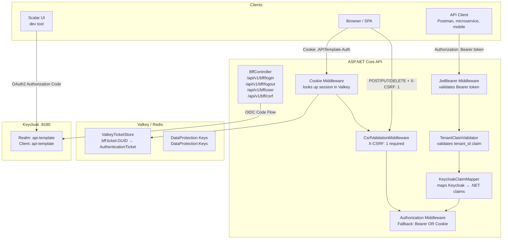
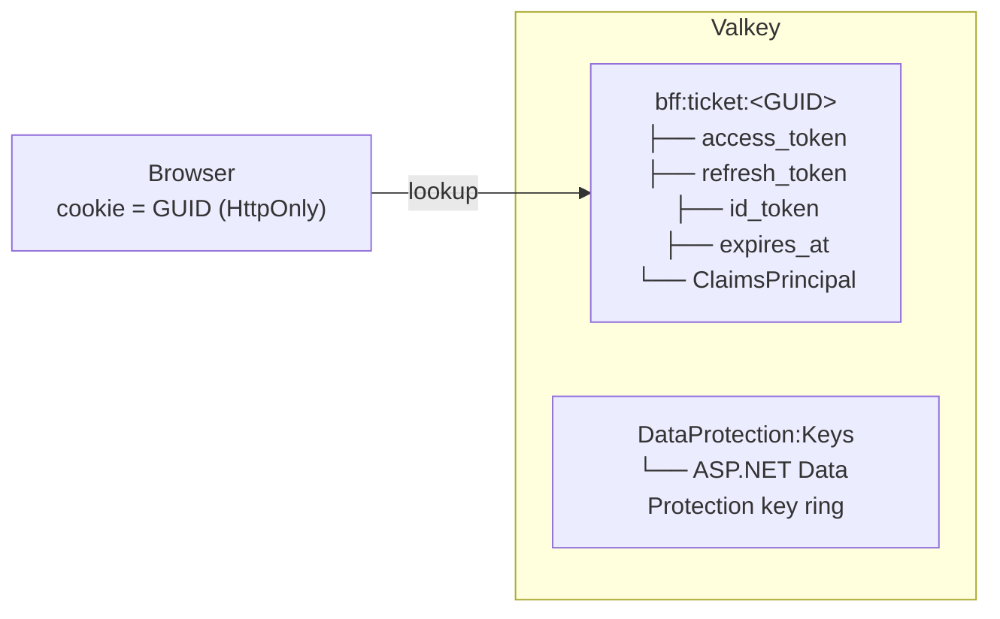

# Authentication & Authorization

## Overview

Project uses **Keycloak** as identity provider with hybrid authentication:

- **JWT Bearer** — direct API access (microservices, mobile apps, Postman, curl)
- **OIDC + Cookie (BFF)** — browser-based login for SPA; tokens never exposed to JavaScript
- **Scalar OAuth2** — interactive OAuth2 Authorization Code flow in Scalar UI (development)
- **Client Credentials** — machine-to-machine (service accounts, background jobs)

## Architecture



---

## Authentication Methods

| Method | Client | Token visible to JS? |
|--------|--------|----------------------|
| **Scalar OAuth2** | Scalar UI (dev tool) | Yes (in Scalar memory only) |
| **JWT Bearer** | Mobile apps, Postman, curl | Yes (client manages it) |
| **Client Credentials** | Microservices, background jobs | N/A (machine-to-machine) |
| **BFF Cookie** | SPA frontend (browser) | **No** — httpOnly cookie, tokens in Valkey |

---

## Quick Start

### 1. Start Infrastructure

```bash
docker compose up -d
```

| Service     | Port  | Description              |
|-------------|-------|--------------------------|
| PostgreSQL  | 5432  | Application database     |
| MongoDB     | 27017 | Product data storage     |
| Keycloak    | 8180  | Identity provider        |
| Valkey      | 6379  | Session store + cache    |

### 2. Default Credentials

| Service                | Username | Password  |
|------------------------|----------|-----------|
| Keycloak Admin Console | admin    | admin     |
| Application User       | admin    | Admin123  |

Default user has role **PlatformAdmin** and tenant `00000000-0000-0000-0000-000000000001`.

### 3. Keycloak Admin Console

```
http://localhost:8180/admin
```

---

## Flow 1 — JWT Bearer (API clients, mobile apps)

```
Client (Postman, mobile app, microservice)
│
│  Step 1: Get token from Keycloak
│  POST http://localhost:8180/realms/api-template/protocol/openid-connect/token
│  grant_type=authorization_code | client_credentials | refresh_token
│
│  Step 2: Call API with token
│  GET /api/v1/products
│  Authorization: Bearer <access_token>
│
▼
[ JwtBearer Middleware ]
  - Downloads JWKS from Keycloak discovery endpoint
  - Validates token signature, issuer, audience, lifetime
▼
[ TenantClaimValidator.OnTokenValidated ]
  - KeycloakClaimMapper: preferred_username → ClaimTypes.Name
  - KeycloakClaimMapper: realm_access.roles[] → ClaimTypes.Role[]
  - Rejects token without tenant_id claim (unless service account)
▼
[ Authorization Middleware ]
  - Fallback policy: requires authenticated user (Bearer OR Cookie)
  - PlatformAdminOnly: requires role "PlatformAdmin"
▼
Controller Action
```

```mermaid
sequenceDiagram
    participant C as Client
    participant KC as Keycloak
    participant API as ASP.NET Core API

    C->>KC: POST /token<br/>(grant_type=authorization_code | client_credentials | refresh_token)
    KC-->>C: access_token
    C->>API: GET /api/v1/products<br/>Authorization: Bearer &lt;token&gt;
    API->>API: JwtBearer Middleware<br/>validates signature, issuer, audience, lifetime
    API->>API: TenantClaimValidator.OnTokenValidated<br/>maps claims, validates tenant_id
    API->>API: Authorization Middleware<br/>Fallback: Bearer OR Cookie
    API-->>C: 200 OK
```

**Get token via curl:**
```bash
TOKEN=$(curl -s -X POST "http://localhost:8180/realms/api-template/protocol/openid-connect/token" \
  -d "grant_type=client_credentials" \
  -d "client_id=api-template" \
  -d "client_secret=dev-client-secret" \
  | jq -r '.access_token')

curl -H "Authorization: Bearer $TOKEN" http://localhost:5174/api/v1/products
```

> **Tip:** Paste the token into [jwt.io](https://jwt.io) to inspect claims (roles, tenant_id, etc.)

---

## Flow 2 — BFF Cookie (SPA / browser)

### 2a. Login

```mermaid
sequenceDiagram
    participant SPA as Browser / SPA
    participant BFF as BffController
    participant OIDC as OIDC Middleware (BffOidc)
    participant KC as Keycloak
    participant VK as Valkey

    SPA->>BFF: GET /api/v1/bff/login?returnUrl=/dashboard
    BFF-->>SPA: 302 → Keycloak login page (Challenge BffOidc)
    SPA->>KC: User enters credentials
    KC-->>OIDC: Authorization code → callback URL
    OIDC->>KC: Exchange code for tokens
    KC-->>OIDC: access_token + refresh_token + id_token
    OIDC->>OIDC: TenantClaimValidator.OnTokenValidated<br/>maps claims, validates tenant_id
    OIDC->>VK: StoreAsync — bff:ticket:&lt;GUID&gt;<br/>TTL = SessionTimeoutMinutes (60 min)
    OIDC-->>SPA: Set-Cookie: .APITemplate.Auth=&lt;GUID&gt;<br/>HttpOnly, SameSite=Lax, Secure<br/>302 → /dashboard
```

### 2b. Authenticated Request

```mermaid
sequenceDiagram
    participant SPA as Browser / SPA
    participant CM as Cookie Middleware
    participant VK as Valkey
    participant CSR as CookieSessionRefresher
    participant KC as Keycloak
    participant CSRF as CsrfValidationMiddleware
    participant AUTHZ as Authorization Middleware

    SPA->>CM: POST /api/v1/products<br/>Cookie: .APITemplate.Auth=&lt;GUID&gt;<br/>X-CSRF: 1
    CM->>VK: RetrieveAsync(&lt;GUID&gt;)
    VK-->>CM: AuthenticationTicket → ClaimsPrincipal
    CM->>CSR: OnValidatePrincipal
    alt Token expires within TokenRefreshThresholdMinutes (2 min)
        CSR->>KC: POST /token (grant_type=refresh_token)
        KC-->>CSR: new access_token + refresh_token
        CSR->>VK: Update session (ShouldRenew = true)
    else Refresh token missing or failed
        CSR-->>SPA: 401 Unauthorized (RejectPrincipal)
    end
    CSR->>CSRF: Validate X-CSRF: 1 header<br/>(GET/HEAD/OPTIONS exempt; JWT Bearer exempt)
    alt Missing X-CSRF header
        CSRF-->>SPA: 403 Forbidden
    end
    CSRF->>AUTHZ: Bearer OR Cookie authenticated
    AUTHZ-->>SPA: Controller Action → 200 OK
```

### 2c. Logout

```mermaid
sequenceDiagram
    participant SPA as Browser / SPA
    participant BFF as BffController
    participant VK as Valkey
    participant KC as Keycloak

    SPA->>BFF: GET /api/v1/bff/logout<br/>Cookie: .APITemplate.Auth=&lt;GUID&gt;
    BFF->>VK: RemoveAsync(&lt;GUID&gt;) — session deleted
    BFF-->>SPA: Clear cookie .APITemplate.Auth
    BFF-->>SPA: 302 → Keycloak end_session_endpoint
    SPA->>KC: End session (SSO invalidated)
    KC-->>SPA: 302 → PostLogoutRedirectUri (/)
```

### 2d. CSRF endpoint

SPA should fetch this before making any non-GET request to learn the required header:

```
GET /api/v1/bff/csrf   (AllowAnonymous)

Response: { "headerName": "X-CSRF", "headerValue": "1" }
```

Then include `X-CSRF: 1` on every POST / PUT / PATCH / DELETE request.

---

## Flow 3 — Scalar OAuth2 (development UI)

```mermaid
sequenceDiagram
    participant DEV as Developer
    participant SC as Scalar UI
    participant KC as Keycloak
    participant API as ASP.NET Core API

    DEV->>SC: Opens /scalar/v1 → clicks Authorize
    Note over SC: BearerSecuritySchemeDocumentTransformer<br/>registers OAuth2 Authorization Code + PKCE (S256)
    SC->>KC: Redirect → Keycloak login page
    DEV->>KC: Enters admin / Admin123
    KC-->>SC: Authorization code → Scalar callback
    SC->>KC: Exchange code → access_token (PKCE S256)
    KC-->>SC: access_token
    SC->>API: All requests with Authorization: Bearer &lt;token&gt;
```

> Uses confidential client `api-template` with PKCE (S256). No separate public client needed.

---

## Flow 4 — Client Credentials (machine-to-machine)

```mermaid
sequenceDiagram
    participant SVC as Microservice / Background Job
    participant KC as Keycloak
    participant API as ASP.NET Core API

    SVC->>KC: POST /token<br/>grant_type=client_credentials<br/>client_id=api-template
    KC-->>SVC: access_token (service account)<br/>preferred_username = "service-account-api-template"
    SVC->>API: Request with Authorization: Bearer &lt;token&gt;
    API->>API: TenantClaimValidator<br/>IsServiceAccount() → true<br/>tenant_id check SKIPPED
    Note over API: EF global filter: HasTenant = false<br/>tenant-scoped entities return empty<br/>Non-tenant endpoints work normally
    API-->>SVC: Response
```

---

## Where Tokens Are Stored



**Security principle:** Tokens never leave the server — the browser only holds an opaque GUID.

---

## Token Claims

JWT tokens must contain these claims:

| Claim                | Description                    | Required                              |
|----------------------|--------------------------------|---------------------------------------|
| `sub`                | Subject (user ID)              | Yes                                   |
| `preferred_username` | Username                       | Yes                                   |
| `email`              | User email                     | Yes                                   |
| `tenant_id`          | Tenant GUID (custom claim)     | Yes (user tokens) / No (service acct) |
| `realm_access.roles` | Keycloak realm roles (JSON)    | No                                    |
| `aud`                | Must include `api-template`    | Yes                                   |
| `iss`                | Keycloak realm issuer URL      | Yes                                   |

**Claim mapping by `KeycloakClaimMapper`:**

| Keycloak claim         | .NET ClaimType         |
|------------------------|------------------------|
| `preferred_username`   | `ClaimTypes.Name`      |
| `realm_access.roles[]` | `ClaimTypes.Role`      |
| `tenant_id`            | `CustomClaimTypes.TenantId` (`"tenant_id"`) |

---

## Authorization Policies

| Policy              | Requirement                          | Used on               |
|---------------------|--------------------------------------|-----------------------|
| Fallback (default)  | Authenticated via Bearer OR Cookie   | All endpoints         |
| `PlatformAdminOnly` | Role: `PlatformAdmin`                | Admin-only endpoints  |

---

## BFF Endpoints

All under `/api/v1/bff/`:

| Endpoint               | Auth required | Description                                      |
|------------------------|---------------|--------------------------------------------------|
| `GET /bff/login`       | No            | Initiates OIDC login, optional `?returnUrl=`     |
| `GET /bff/logout`      | Cookie        | Clears session in Valkey, signs out of Keycloak  |
| `GET /bff/user`        | Cookie        | Returns current user claims as JSON              |
| `GET /bff/csrf`        | No            | Returns CSRF header name/value contract          |

**`GET /bff/user` response:**
```json
{
  "userId": "unique-user-id",
  "username": "admin",
  "email": "admin@example.com",
  "tenantId": "00000000-0000-0000-0000-000000000001",
  "roles": ["PlatformAdmin"]
}
```

Returns `401` (not redirect) when unauthenticated — SPA should redirect to `/api/v1/bff/login`.

---

## Session & Token Lifecycle

| Setting                      | Default | Config key                               |
|------------------------------|---------|------------------------------------------|
| Session timeout              | 60 min  | `Bff:SessionTimeoutMinutes`              |
| Sliding expiration           | enabled | `CookieAuthenticationOptions`            |
| Token refresh threshold      | 2 min   | `Bff:TokenRefreshThresholdMinutes`       |
| Scopes requested from OIDC   | openid, profile, email, offline_access | `Bff:Scopes` |

**Token refresh trigger:** On every cookie-authenticated request, `CookieSessionRefresher` checks if the access token expires within `TokenRefreshThresholdMinutes`. If so, it silently calls Keycloak `/token` with `grant_type=refresh_token` and updates the session in Valkey.

---

## Keycloak Realm Configuration

Realm auto-imported on `docker compose up` from `infrastructure/keycloak/realms/api-template-realm.json`.

### Realm: `api-template`

- Self-registration: Disabled
- Brute force protection: 5 attempts → lockout 1–15 min, reset after 1h
- Email login: Allowed
- SSL: None (development)
- Remember Me: Enabled (SSO session up to 15 days)
- Password policy: min 8 chars, 1 uppercase, 1 digit, expires after 365 days
- Refresh token rotation: Enabled (old refresh token revoked on each use)

### Roles

| Role            | Description            |
|-----------------|------------------------|
| `PlatformAdmin` | Full platform access   |
| `User`          | Regular tenant user    |

### Client: `api-template`

| Setting                  | Value                                      |
|--------------------------|--------------------------------------------|
| Type                     | Confidential                               |
| Secret                   | `dev-client-secret` (dev only)             |
| Standard Flow            | Enabled (Authorization Code + PKCE S256)   |
| Service Accounts         | Enabled (Client Credentials grant)         |
| Direct Access Grants     | Disabled (password grant removed in OAuth 2.1) |
| PKCE                     | Required (`S256`)                          |
| Redirect URIs            | `http://localhost:5174/*`, `http://localhost:8080/*` |

> **OAuth 2.1 compliance:** All Authorization Code flows (BFF, Scalar, mobile) enforce PKCE (`code_challenge_method=S256`).

### Custom Protocol Mappers

| Mapper         | Type              | Source attribute | JWT claim             |
|----------------|-------------------|------------------|-----------------------|
| `tenant_id`    | User Attribute    | `tenant_id`      | `tenant_id`           |
| audience-mapper| Audience Mapper   | —                | `aud`                 |
| realm-roles    | Realm Role Mapper | realm roles      | `realm_access.roles`  |

### Standard Keycloak Endpoints

| Endpoint      | URL                                                               |
|---------------|-------------------------------------------------------------------|
| Discovery     | `/realms/{realm}/.well-known/openid-configuration`                |
| Token         | `/realms/{realm}/protocol/openid-connect/token`                   |
| Authorization | `/realms/{realm}/protocol/openid-connect/auth`                    |
| Logout        | `/realms/{realm}/protocol/openid-connect/logout`                  |
| UserInfo      | `/realms/{realm}/protocol/openid-connect/userinfo`                |

When the API sets `options.Authority`, ASP.NET auto-discovers all endpoints via the Discovery URL.

---

## Configuration

### appsettings.Development.json

```json
{
  "Keycloak": {
    "realm": "api-template",
    "auth-server-url": "http://localhost:8180/",
    "ssl-required": "none",
    "resource": "api-template",
    "credentials": {
      "secret": "dev-client-secret"
    }
  }
}
```

### appsettings.json — BFF section

```json
{
  "Bff": {
    "CookieName": ".APITemplate.Auth",
    "PostLogoutRedirectUri": "/",
    "SessionTimeoutMinutes": 60,
    "Scopes": ["openid", "profile", "email", "offline_access"],
    "TokenRefreshThresholdMinutes": 2
  }
}
```

### Production Environment Variables

| Variable                           | Description                       |
|------------------------------------|-----------------------------------|
| `KC_HOSTNAME`                      | Keycloak external hostname        |
| `Keycloak__realm`                  | Keycloak realm name               |
| `Keycloak__resource`               | Client ID                         |
| `Keycloak__credentials__secret`    | Client secret                     |
| `Valkey__ConnectionString`         | Valkey/Redis connection string    |

---

## Testing

### Integration Tests

Tests use mock JWT authentication that bypasses Keycloak entirely:

```csharp
// Authenticate with PlatformAdmin role
IntegrationAuthHelper.Authenticate(client, role: UserRole.PlatformAdmin);

// Authenticate with specific tenant
IntegrationAuthHelper.Authenticate(client,
    tenantId: myTenantGuid,
    role: UserRole.User);
```

Test tokens are signed with RSA-256 using an in-memory test key pair and include all required claims (`tenant_id`, roles, etc.).

**BFF/CSRF tests** use `BffSecurityWebApplicationFactory` with `FakeCookieAuthStartupFilter`:
- Set request header `X-Test-Cookie-Auth: 1` to simulate a cookie-authenticated session
- Non-GET requests without `X-CSRF: 1` return HTTP 403

---

## Key Source Files

| File | Description |
|------|-------------|
| `Extensions/AuthenticationServiceCollectionExtensions.cs` | All auth registration: JWT Bearer + Cookie + OIDC + policies |
| `Extensions/ApplicationBuilderExtensions.cs` | Middleware pipeline order |
| `Api/Controllers/V1/BffController.cs` | BFF endpoints: login / logout / user / csrf |
| `Api/Middleware/CsrfValidationMiddleware.cs` | CSRF header enforcement for cookie-authenticated requests |
| `Api/OpenApi/BearerSecuritySchemeDocumentTransformer.cs` | Registers OAuth2 flow in Scalar/OpenAPI spec |
| `Application/Common/Options/BffOptions.cs` | BFF configuration model |
| `Application/Common/Options/KeycloakOptions.cs` | Keycloak configuration model |
| `Application/Common/Security/BffAuthenticationSchemes.cs` | Auth scheme name constants |
| `Application/Common/Security/AuthorizationPolicies.cs` | Policy name constants |
| `Application/Common/Security/CustomClaimTypes.cs` | Custom claim type constants (`tenant_id`) |
| `Infrastructure/Security/ValkeyTicketStore.cs` | Server-side session store (Valkey); cookie holds only GUID |
| `Infrastructure/Security/CookieSessionRefresher.cs` | Silent token refresh on cookie validation |
| `Infrastructure/Security/TenantClaimValidator.cs` | Validates tenant_id claim; maps Keycloak claims |
| `Infrastructure/Security/KeycloakClaimMapper.cs` | Maps preferred_username + realm roles to .NET claim types |
| `Infrastructure/Security/KeycloakUrlHelper.cs` | Builds Keycloak authority URL |
| `Infrastructure/Health/KeycloakHealthCheck.cs` | Keycloak health check endpoint |
| `infrastructure/keycloak/realms/api-template-realm.json` | Keycloak realm auto-import |


