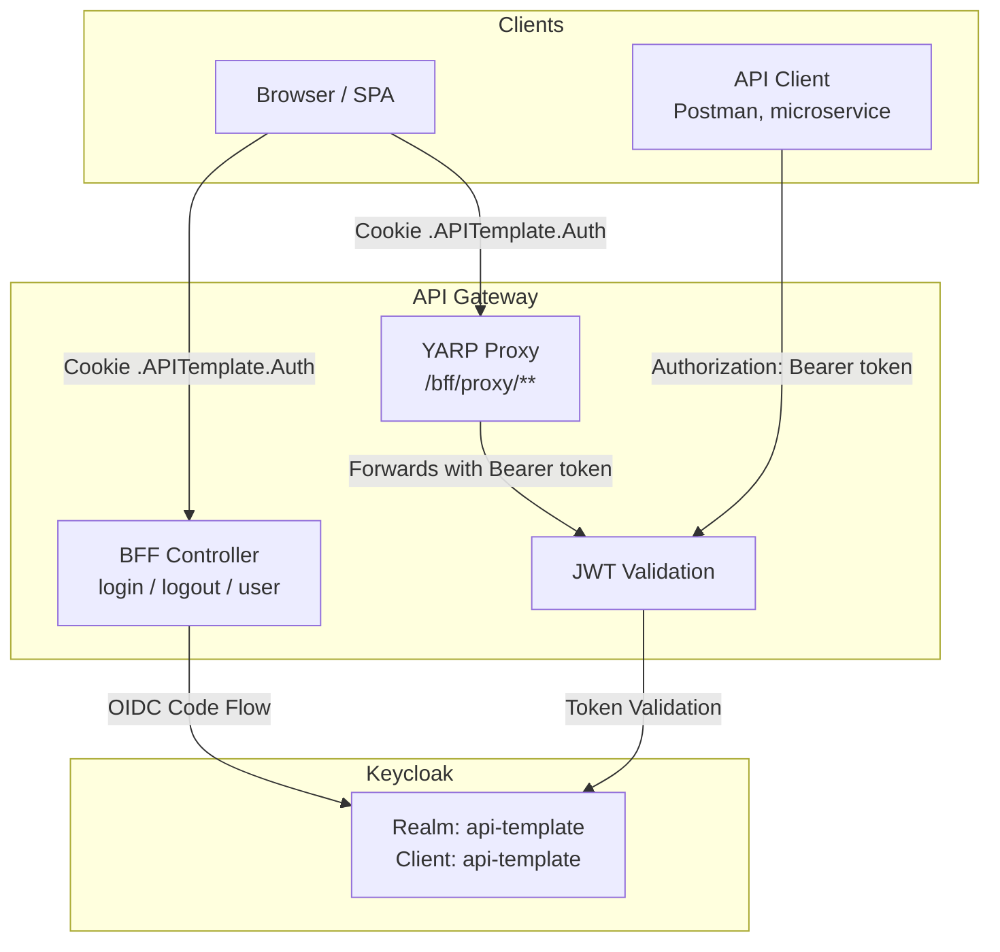

# Authentication & Authorization

## Overview

Project uses **Keycloak** as identity provider with hybrid **BFF (Backend-for-Frontend)** pattern:

- **JWT Bearer** - direct API access (microservices, mobile apps, Postman)
- **OIDC + Cookie** - browser-based login via BFF endpoints
- **YARP Reverse Proxy** - automatically forwards access tokens from cookie sessions

## Architecture



## Quick Start

### 1. Start Infrastructure

```bash
docker-compose up -d
```

Services:
| Service       | Port  | Description              |
|---------------|-------|--------------------------|
| PostgreSQL    | 5432  | Application database     |
| MongoDB       | 27017 | Product data storage     |
| Keycloak      | 8180  | Identity provider        |
| Keycloak DB   | (internal) | Keycloak PostgreSQL   |

### 2. Default Credentials

| Service   | Username | Password |
|-----------|----------|----------|
| Keycloak Admin Console | admin | admin |
| Application User       | admin | Admin123 |

Default user has role **PlatformAdmin** and tenant `00000000-0000-0000-0000-000000000001`.

### 3. Keycloak Admin Console

```
http://localhost:8180/admin
```

## Authentication Methods

The API supports 4 authentication methods. Each serves a different client type:

| Method | Client | How it works | Token visible to JS? |
|--------|--------|-------------|---------------------|
| **Scalar OAuth2** | Scalar UI (dev tool) | OAuth2 Authorization Code flow via public Keycloak client | Yes (in Scalar memory) |
| **JWT Bearer** | Mobile apps, Postman, curl | Client obtains token from Keycloak, sends in `Authorization` header | Yes (client manages it) |
| **Client Credentials** | Microservices, background jobs | Service authenticates with client_id + secret, no user involved | N/A (machine-to-machine) |
| **BFF Cookie** | SPA frontend (browser) | Backend handles login, stores token in httpOnly cookie | No (secure) |
| **BFF + YARP Proxy** | SPA frontend calling API | YARP extracts token from cookie, adds Bearer header, forwards to API | No (secure) |

### Where is each method configured?

| Method | Configuration files | Key code |
|--------|-------------------|----------|
| **Scalar OAuth2** | `appsettings.json` → `Keycloak` section, realm JSON → client `api-template-scalar` | `Api/OpenApi/BearerSecuritySchemeDocumentTransformer.cs` — registers OAuth2 flow in OpenAPI spec using `IOptions<KeycloakOptions>` |
| **JWT Bearer** | `appsettings.Development.json` → `Keycloak` section (realm, auth-server-url, resource, credentials.secret) | `Extensions/AuthenticationServiceCollectionExtensions.cs:90-105` — `.AddJwtBearer()` with Authority, Audience, token validation |
| **Client Credentials** | realm JSON → `api-template` client: `serviceAccountsEnabled: true` | Same JWT Bearer validation — token is issued by Keycloak, API doesn't distinguish grant type |
| **BFF Cookie** | `appsettings.json` → `Bff` section (CookieName, SessionTimeoutMinutes, Scopes, PostLogoutRedirectUri) | `Extensions/AuthenticationServiceCollectionExtensions.cs:106-138` — `.AddCookie()` + `.AddOpenIdConnect()`, `Api/Controllers/V1/BffController.cs` — login/logout/user endpoints |
| **BFF + YARP Proxy** | `appsettings.json` → `ReverseProxy` section (Routes, Clusters, AuthorizationPolicy: `BffProxy`) | `Extensions/ServiceCollectionExtensions.cs:50-58` — `.AddReverseProxy().LoadFromConfig()`, `Infrastructure/Security/BffTokenTransformProvider.cs` — extracts cookie token → Bearer header |

**Registration order in `Program.cs`:**
```
AddAuthenticationOptions()          → binds IOptions<KeycloakOptions>, IOptions<BffOptions>, CORS
AddKeycloakBffAuthentication()      → registers JWT Bearer + Cookie + OIDC schemes, authorization policies
AddBffReverseProxy()                → registers YARP with BffTokenTransformProvider
```

**Keycloak realm** is defined in `infrastructure/keycloak/realms/api-template-realm.json` and auto-imported on `docker-compose up`. It configures clients, roles, protocol mappers, users, password policy, and brute force protection.

### When to use which?

| Scenario | Method | Why |
|----------|--------|-----|
| Testing API during development | **Scalar OAuth2** | Visual UI, click Authorize, test endpoints |
| Quick token test from terminal | **JWT Bearer** (Client Credentials) | One curl command to get token |
| Mobile app (iOS/Android) | **JWT Bearer** (Authorization Code + PKCE) | PKCE enforced (`S256`), standard OAuth2 mobile flow |
| Service-to-service communication | **Client Credentials** | No user involved, machine-to-machine, `serviceAccountsEnabled: true` |
| SPA frontend — login/logout/user info | **BFF Cookie** | Secure, no token exposure to JavaScript |
| SPA frontend — calling API endpoints | **BFF + YARP Proxy** | Cookie → Bearer translation, transparent for SPA |

### Keycloak Standard Endpoints

Keycloak automatically provides these OpenID Connect endpoints for each realm:

| Endpoint | URL | Purpose |
|----------|-----|---------|
| Discovery | `/realms/{realm}/.well-known/openid-configuration` | Lists all available endpoints and configuration |
| Token | `/realms/{realm}/protocol/openid-connect/token` | Exchange credentials/code for tokens |
| Authorization | `/realms/{realm}/protocol/openid-connect/auth` | Login page (browser redirect) |
| Logout | `/realms/{realm}/protocol/openid-connect/logout` | End Keycloak session |
| UserInfo | `/realms/{realm}/protocol/openid-connect/userinfo` | Get user info from token |

These endpoints are public by design (like Google or GitHub login pages). Security comes from credentials, HTTPS in production, and brute force protection — not from hiding the URLs.

When the API sets `options.Authority`, ASP.NET downloads the Discovery endpoint and auto-discovers everything else.

---

## Testing Each Method

### 1. Scalar OAuth2

1. Open `http://localhost:5174/scalar`
2. Click **Authorize**
3. Keycloak login page opens → enter `admin` / `Admin123`
4. Scalar receives token → all requests include it automatically
5. Try `GET /api/v1/products`

Uses Keycloak client `api-template-scalar` (public, no secret needed).

### 2. JWT Bearer via curl

```bash
# Get token from Keycloak (client credentials — no user context)
TOKEN=$(curl -s -X POST "http://localhost:8180/realms/api-template/protocol/openid-connect/token" \
  -d "grant_type=client_credentials" \
  -d "client_id=api-template" \
  -d "client_secret=dev-client-secret" \
  | jq -r '.access_token')

# Call API with token
curl -H "Authorization: Bearer $TOKEN" http://localhost:5174/api/v1/products
```

> **Note:** Client Credentials tokens have no user context (`sub`). For user-scoped tokens, use the Scalar OAuth2 flow or BFF login.

> **Tip:** Paste the token into [jwt.io](https://jwt.io) to inspect claims (roles, tenant_id, etc.)

### 3. BFF Cookie (browser)

1. Open `http://localhost:5174/api/v1/bff/login?returnUrl=/api/v1/bff/user`
2. Keycloak login page → enter `admin` / `Admin123`
3. After login, you see JSON with user info
4. Cookie `.APITemplate.Auth` is now stored in browser
5. Visit `http://localhost:5174/api/v1/bff/user` — works without re-login
6. Logout: `http://localhost:5174/api/v1/bff/logout`

### 4. Client Credentials (service-to-service)

```bash
# Get token without any user (machine-to-machine)
TOKEN=$(curl -s -X POST "http://localhost:8180/realms/api-template/protocol/openid-connect/token" \
  -d "grant_type=client_credentials" \
  -d "client_id=api-template" \
  -d "client_secret=dev-client-secret" \
  | jq -r '.access_token')

# Call API with service account token
curl -H "Authorization: Bearer $TOKEN" http://localhost:5174/api/v1/products
```

> **Note:** Client Credentials token has no `sub` (user) — it represents the service itself. The token will contain the client's service account roles. Since service accounts have no `tenant_id`, tenant-scoped endpoints will return empty results (EF global filter uses `HasTenant = false`). Service accounts can access non-tenant endpoints (health, admin, etc.).

### 5. BFF + YARP Proxy (browser, after BFF login)

After logging in via BFF (step 3 above):

```
http://localhost:5174/bff/proxy/api/v1/products
```

YARP strips `/bff/proxy`, extracts token from cookie, adds `Authorization: Bearer` header, and forwards to the API. The response is returned directly to the browser.

---

## BFF Endpoints

All BFF endpoints are under `/api/v1/bff/`:

### `GET /api/v1/bff/login`

Initiates OIDC login flow. Anonymous access.

| Parameter   | Type   | Required | Description                        |
|-------------|--------|----------|------------------------------------|
| `returnUrl` | string | No       | Redirect URL after login (local only) |

**Response:** HTTP 302 redirect to Keycloak login page.

### `GET /api/v1/bff/logout`

Terminates session and revokes tokens. Requires authentication (Cookie scheme).

**Response:** HTTP 302 redirect to `PostLogoutRedirectUri` (default: `/`).

### `GET /api/v1/bff/user`

Returns current authenticated user info. Requires authentication (Cookie scheme).

**Response:**
```json
{
  "userId": "unique-user-id",
  "username": "admin",
  "email": "admin@example.com",
  "tenantId": "00000000-0000-0000-0000-000000000001",
  "roles": ["PlatformAdmin"]
}
```

**Without cookie:** Returns HTTP 401 (not a redirect). SPA should handle 401 and redirect to `/bff/login`.

## YARP Reverse Proxy (BFF Proxy)

Requests to `/bff/proxy/**` are proxied with automatic token injection:

```
GET /bff/proxy/api/v1/products
  → BffProxy policy authenticates via Cookie scheme
  → strips /bff/proxy prefix
  → extracts access_token from cookie session
  → adds Authorization: Bearer <token> header
  → forwards to internal API as GET /api/v1/products
```

This allows SPAs to call the API without handling tokens directly.

## Token Requirements

JWT tokens must contain these claims:

| Claim                | Description                | Required |
|----------------------|----------------------------|----------|
| `sub`                | Subject (user ID)          | Yes      |
| `preferred_username` | Username                   | Yes      |
| `email`              | User email                 | Yes      |
| `tenant_id`          | Tenant GUID (custom claim) | Yes (user tokens) / No (Client Credentials) |
| `roles`              | User roles                 | No       |
| `aud`                | Must include `api-template`| Yes      |
| `iss`                | Keycloak realm issuer URL  | Yes      |

**Tenant validation:** User tokens **must** include `tenant_id` — tokens without it are rejected with 401. Client Credentials (service account) tokens are exempt because they represent a service, not a user. Service accounts are identified by `preferred_username` starting with `service-account-`. Since service accounts have no tenant, the EF global filter returns empty results for tenant-scoped entities (`HasTenant = false`).

**Claim Mapping:** `KeycloakClaimMapper` maps Keycloak-specific claims to standard .NET ClaimTypes:
- `preferred_username` → `ClaimTypes.Name`
- `realm_access.roles` (nested JSON) → individual `ClaimTypes.Role` claims

## Authorization Policies

| Policy            | Requirement         |
|-------------------|---------------------|
| Default           | Authenticated user  |
| `PlatformAdminOnly` | Role: PlatformAdmin |

## Keycloak Realm Configuration

Realm is auto-imported on startup from `infrastructure/keycloak/realms/api-template-realm.json`.

### Realm: `api-template`

- Self-registration: Disabled
- Brute force protection: Enabled (5 attempts → lockout 1-15 min, reset after 1h)
- Email login: Allowed
- SSL: None (development)
- Remember Me: Enabled (SSO session up to 15 days)
- Password policy: min 8 chars, 1 uppercase, 1 digit, expiry after 365 days
- Refresh token rotation: Enabled (old refresh token revoked on use, no reuse allowed)
- Session timeouts:
  - Without Remember Me: 30 min idle / 10 hours max
  - With Remember Me: 7 days idle / 15 days max

### Roles

| Role           | Description             |
|----------------|-------------------------|
| PlatformAdmin  | Full platform access    |
| User     | Regular tenant user     |

### Client: `api-template`

- Type: Confidential
- Secret: `dev-client-secret` (dev only)
- Standard Flow: Enabled (Authorization Code + PKCE)
- Service Accounts: Enabled (Client Credentials grant)
- Direct Access Grants: Disabled (password grant is insecure and removed from OAuth 2.1)
- PKCE: Required (`S256`)

> **OAuth 2.1 compliance:** Both clients enforce PKCE (`pkce.code.challenge.method: S256`). All Authorization Code flows (Scalar, BFF, mobile) must include `code_challenge` and `code_verifier`.
- Redirect URIs: `http://localhost:5174/*`, `http://localhost:8080/*`
- Web Origins: `http://localhost:5174`, `http://localhost:8080`

### Custom Protocol Mappers

| Mapper          | Type              | Source Attribute | Token Claim |
|-----------------|-------------------|------------------|-------------|
| tenant_id       | User Attribute    | `tenant_id`      | `tenant_id` |
| audience-mapper | Audience Mapper   | -                | `aud`       |
| realm-roles     | Realm Role Mapper | realm roles      | `realm_access.roles` |

## Configuration

### appsettings.Development.json

```json
{
  "Keycloak": {
    "realm": "api-template",
    "auth-server-url": "http://localhost:8180/",
    "ssl-required": "none",
    "resource": "api-template",
    "credentials": {
      "secret": "dev-client-secret"
    }
  }
}
```

### BFF Options (appsettings.json)

```json
{
  "Bff": {
    "CookieName": ".APITemplate.Auth",
    "PostLogoutRedirectUri": "/",
    "SessionTimeoutMinutes": 60,
    "Scopes": ["openid", "profile", "email", "offline_access"]
  }
}
```

### Production Environment Variables

| Variable                          | Description                    |
|-----------------------------------|--------------------------------|
| `KC_HOSTNAME`                     | Keycloak external hostname     |
| `KC_REALM`                        | Keycloak realm name            |
| `KC_CLIENT_ID`                    | Client ID                      |
| `KC_CLIENT_SECRET`                | Client secret                  |
| `KC_DB_USERNAME` / `KC_DB_PASSWORD` | Keycloak database credentials |
| `APITEMPLATE_REDACTION_HMAC_KEY`  | HMAC key for log redaction     |

## Testing

### Integration Tests

Tests use a mock JWT authentication setup that bypasses Keycloak:

```csharp
// Authenticate test client with PlatformAdmin role
IntegrationAuthHelper.Authenticate(client, role: UserRole.PlatformAdmin);

// Authenticate with specific tenant
IntegrationAuthHelper.Authenticate(client,
    tenantId: myTenantGuid,
    role: UserRole.User);
```

Test tokens are signed with RSA-256 using a test key pair and contain all required claims including `tenant_id`.

### Manual Testing with Swagger/Scalar

1. Open API docs at `http://localhost:8080/scalar/v1`
2. Click "Authorize" and enter Bearer token
3. Token flow is documented in OpenAPI spec via `BearerSecuritySchemeDocumentTransformer`

## Key Source Files

| File | Description |
|------|-------------|
| `Extensions/AuthenticationServiceCollectionExtensions.cs` | Authentication setup (JWT + OIDC + Cookie) |
| `Extensions/ServiceCollectionExtensions.cs` | YARP reverse proxy configuration |
| `Extensions/ApplicationBuilderExtensions.cs` | Middleware pipeline order |
| `Api/Controllers/V1/BffController.cs` | BFF endpoints (login/logout/user) |
| `Application/Common/Options/BffOptions.cs` | BFF configuration model |
| `Application/Common/Security/BffAuthenticationSchemes.cs` | Auth scheme constants |
| `Infrastructure/Security/BffTokenTransformProvider.cs` | YARP token injection |
| `Infrastructure/Security/TenantClaimValidator.cs` | Tenant claim validation (required for user tokens, skipped for service accounts) + logging |
| `Infrastructure/Security/KeycloakClaimMapper.cs` | Keycloak → .NET claim type mapping |
| `Infrastructure/Security/KeycloakUrlHelper.cs` | Keycloak URL construction |
| `Application/Common/Options/KeycloakOptions.cs` | Strongly-typed Keycloak configuration |
| `Infrastructure/Health/KeycloakHealthCheck.cs` | Keycloak health check |
| `infrastructure/keycloak/realms/api-template-realm.json` | Keycloak realm import |
